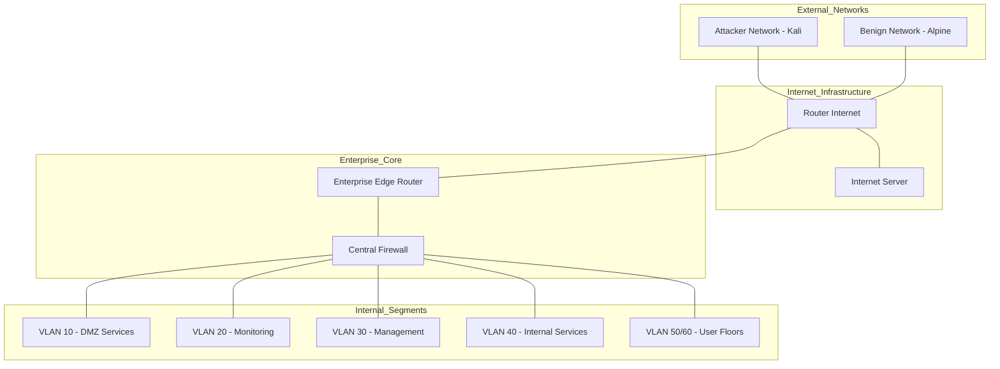

# Network Design

This page describes the **logical and physical design** of the VNTD network topology, focusing on how components are interconnected and how responsibilities are distributed 
across the infrastructure.

---

## Topology Overview

The topology simulates a **multi-zone enterprise network** connected to external devices. It is built around a central Internet core and a segmented enterprise network protected by a router and a firewall.

The topology consists of:

- An Internet core router.
- Separate external networks (attacker and benign).
- An enterprise router.
- A central firewall.
- Multiple VLAN-based internal segments.

<figure markdown="span">
  
  <figcaption>Provided topology</figcaption>
</figure>

---

## External Networks

### Internet Core

The router (`router_internet`) located at the center of the topology represents the public Internet core. It serves as the interconnection point for:

- External benign traffic.
- External attacker traffic.
- Enterprise outbound and inbound traffic.

This router uses FRRouting (FRR) to provide realistic routing behavior.

Within the network, a server (`internet_server`) can be appreciated, simulating common internet services.

---

### Attacker Network

The attacker network simulates a hostile external actor:

- A dedicated router (`router_attacker`).
- A Kali Linux-based attacker node.

This network is intentionally separated to allow controlled attack generation.

!!! warning
    Attack simulations should only be executed inside this isolated environment.

---

### Benign Network

The benign network simulates legitimate external users:

- A dedicated router (`router_benign`).
- A lightweight client node.

This allows differentiation between malicious and legitimate traffic.

---

!!! info "Configuration Persistence"
    All configurations for routers and switches are decoupled from the images and mounted via bind in the topology definition file. Changes applied directly on the machines do not persist.

---

## Enterprise Core

### Enterprise Edge Router

The `router_enterprise` node connects the enterprise network to the Internet. Its responsibilities include:

- Routing between enterprise and external networks (`NAT`).
- Forwarding traffic toward the firewall.
- Acting as a clear limit between external and internal domains.

---

### Firewall

The firewall is the **central enforcement point** of the enterprise:

- Enforces inter-VLAN policies.
- Controls inbound and outbound traffic.
- Mirrors traffic to the IDS.
- Hosts DHCP relay functionality.
- Acts as the default gateway for all VLANs.

!!! important "VLAN Communication"
    All enterprise VLANs are isolated by default. Inter-VLAN communication is only possible through explicit firewall rules.

---

## Layer 2 Segmentation

VLANs are implemented using the custom firewall images, but L2 package traffic is managed with **Arista cEOS switches**, providing realistic L2 behavior:

- Access ports for end devices.
- Trunk ports for multi-VLAN floors.
- Clear separation between zones.

Each VLAN maps to a dedicated VLAN gateway. This VLAN gateway represents the firewall. The firewall works both as a L3 switch and as a security device.

---

## Monitoring Placement

Monitoring and IDS nodes are placed in a dedicated VLAN, reading all traffic outgoing and incoming the enterprise network, ensuring:

- Visibility into enterprise traffic.
- Isolation from services and users.

Traffic mirroring and promiscuous interfaces are used where required to capture relevant packets.

!!! tip
    This placement ensures maximum visibility with minimal configuration.
