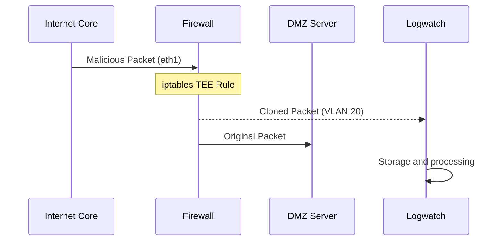
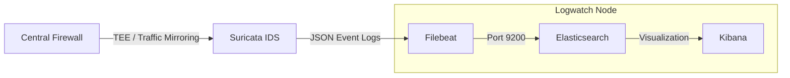

# Traffic Flows

This page documents the **expected traffic flows** within the architecture and the **security logic** enforced by the network devices. Understanding these flows is critical for debugging and validating the network.

---

## Routing & Connectivity Logic

The environment uses a hybrid routing model to ensure internal isolation while maintaining controlled external accessibility.

### External Routing (OSPF)

The **Enterprise Edge Router** (**router-enterprise**) uses OSPF to communicate with the Internet Core:
- **Advertisement:** It announces the public address (`172.16.30.2/30`).
- **Static Internal Routing:** To ensure traffic reaches internal VLANs, the router has static routes pointing all `192.168.0.0/16` traffic to the **Firewall** (`192.168.0.2`).

### Internal Routing

- **Default Gateway:** The firewall acts as the default gateway for all enterprise VLANs (10, 20, 30, 40, 50 & 60).
- **Default Route:** The firewall sends all unknown traffic to the Enterprise Router interface (`192.168.0.1`).

---

## Security Policies (iptables)

The Firewall implements a **Default DROP** policy for all INPUT and FORWARD packets. Only explicit flows are permitted.

### Core Firewall Rules

- **Stateful Inspection:** All established and related traffic is allowed via `conntrack`, ensuring response packets from valid connections are not blocked.
- **Management:** ICMP (Ping) is allowed from the enterprise subnets to the firewall itself for diagnostic and testing purposes.
- **Loopback:** Full access is allowed on the local loopback (`lo`) interface.

!!! note "Policies format"
    Policies are designed to be explicit rather than permissive.

### Inter-Zone Communication

| Source          | Destination             | Permitted Traffic / Protocols                           |
|-----------------|-------------------------|---------------------------------------------------------|
| Admin (VLAN 30) | Any                     | Unrestricted full access to all subnets and Internet    |
| Users (50/60)   | Internet, DMZ, Services | Web browsing, internal services access, and DNS queries |
| Services (40)   | Admin, Users            | General connectivity and responses to internal requests |
| Monitoring (20) | -                       | None, restricted to passive observation                 |
| DMZ (10)        | Internet                | DNS forwarding and Outbound Mail Relay (SMTP)           |

!!! note "Intra-VLAN Traffic"
    Traffic between devices from the same VLAN is permitted and handled by the Arista L2 switches without firewall intervention (Given that both devices are found within the same switch). 

---

## Specific Protocol Flows

### Inbound (DNAT)

All inbound traffic arriving on the Enterprise Router's WAN interface (`eth1`) is forwarded wholesale to the Firewall using a catch-all DNAT rule:

```bash
# router-enterprise startup.sh
iptables -t nat -A PREROUTING -i eth1 -j DNAT --to-destination 192.168.0.2
```

The Firewall then applies its own per-port DNAT rules to direct traffic to the correct DMZ service:

```bash
# firewall startup.sh
iptables -t nat -A PREROUTING -i eth1 -p tcp -m multiport --dports 80,22,53,25 -j DNAT --to-destination 192.168.10.10
iptables -t nat -A PREROUTING -i eth1 -p udp --dport 53 -j DNAT --to-destination 192.168.10.10
```

---

## Outbound (SNAT)

Outbound traffic from enterprise VLANs is masqueraded at the Enterprise Router:

```bash
# router-enterprise startup.sh
iptables -t nat -A POSTROUTING -o eth1 -j MASQUERADE
```

---

## Firewall Configuration Files

The firewall behaviour is entirely defined by a startup script mounted at runtime. Three variants are provided, each suited to a different scenario.

### Available Variants

| File                  | Topology File               | Description                                                           |
|-----------------------|-----------------------------|-----------------------------------------------------------------------|
| `startup.sh`          | `topology.clab.yml`         | Full topology: two floor switches, VLANs 50 and 60 on separate floors |
| `startup_reduced.sh`  | `topology_reduced.clab.yml` | Reduced topology: one floor switch only, lower resource consumption   |
| `startup_hardened.sh` | (optional, see below)       | Adds rate limiting and logging rules for a more defended environment  |

Both `startup.sh` and `startup_reduced.sh` are **intentionally permissive** with respect to attack traffic. Rules allow attacks to reach their targets so that Suricata can observe and log them. Neither file attempts to block the simulated attack scenarios.

### Differences Between `startup.sh` and `startup_reduced.sh`

The reduced variant handles one fewer physical interface (`eth7` is absent) and only configures VLAN bridges for Floor 1:

```bash
# startup.sh - two floors
ip link add link eth6 name eth6.50 type vlan id 50
ip link add link eth6 name eth6.60 type vlan id 60
ip link add link eth7 name eth7.50 type vlan id 50   # Floor 2 only
ip link add link eth7 name eth7.60 type vlan id 60   # Floor 2 only
```

```bash
# startup_reduced.sh - one floor
ip link add link eth6 name eth6.50 type vlan id 50
ip link add link eth6 name eth6.60 type vlan id 60
# eth7 is not present in the reduced topology
```

Use `startup_reduced.sh` with `topology_reduced.clab.yml` when available RAM is below 20 GB.

### Optional: `startup_hardened.sh`

For scenarios where you want the enterprise network to simulate a more defensive approach; while still allowing attacks to be observed by Suricata; a hardened variant can be created by adding the following rules to a copy of `startup.sh`, after the base policy block and before the VLAN-specific rules.

These rules silently drop traffic that exceeds the configured thresholds. Suricata continues to see and alert on everything via the TEE mirror because mirroring happens before the DROP rules are evaluated.

```bash
# SSH rate limiting - drop connections exceeding 30 new sessions per minute per source
iptables -A FORWARD -p tcp --dport 22 -m state --state NEW -m recent --set --name SSH_RATE
iptables -A FORWARD -p tcp --dport 22 -m state --state NEW -m recent --update --seconds 60 --hitcount 30 --name SSH_RATE -j DROP

# ICMP rate limiting - allow up to 10 echo requests per second, drop the rest
iptables -A FORWARD -p icmp --icmp-type echo-request -m limit --limit 10/sec --limit-burst 20 -j ACCEPT
iptables -A FORWARD -p icmp --icmp-type echo-request -j DROP

# SYN rate limiting - allow up to 200 new TCP connections per second, drop flood traffic
iptables -A FORWARD -p tcp --syn -m limit --limit 200/sec --limit-burst 400 -j ACCEPT
iptables -A FORWARD -p tcp --syn -j DROP
```

No changes are required on the topology file if the same startup script is updated.
in place of `startup.sh` in the topology file:

!!! note "Detection vs Prevention"
    The hardened variant is designed for **detection research**, not production hardening. Traffic is dropped silently rather than logged, keeping the log clean while Suricata still captures the full attack details.

---

## Infrastructure Service Flows

=== "DHCP Relay Mechanism"

    Since the **DHCP Server** is found in VLAN 40, but clients are in VLAN 50/60, the firewall bridges the gap performing a relay:

    1.  **Client**: Broadcasts a `DHCPDISCOVER` on its local bridge.
    2.  **Firewall**: The `isc-dhcp-relay` service picks up the broadcast and forwards it as **unicast** to `192.168.40.10`.
    3.  **Server**: Sends a `DHCPOFFER` back to the firewall relay.
    4.  **Firewall**: Forwards the offer back to the originating VLAN floor.

=== "DNS Resolution"
    
    The DMZ server provides DNS service to individuals within the enterprise network. Devices using DHCP will receive the DNS address automatically upon IP assignment. This service responds to the name addresses referencing the internal server.

    Given the situation that an unknown address is received, the DNS forwards the request to the DNS located on the Internet Server:

    - **Internal Query**: Clients query the `dmz-server` (`192.168.10.10`).
    - **External Forwarding**: If the `dmz-server` cannot resolve the name, it forwards the request to the `internet-server` (`172.16.100.100`) at the Internet core.

=== "Mail Service (SMTP/IMAP)" 

    The mail architecture follows a hub-and-spoke model:

    - **Outbound**: Internal clients send mail to the DMZ Server, which relays it to the Internet Mail Server (if the destination is not the server itself).
    - **Inbound**: The Internet server forwards mail to the Enterprise IP, where it is sent with DNAT through the router and firewall to port 25 of the DMZ node.
    - **Retreival**: Users access their mail via IMAP on port 143 (unencrypted for inspection purposes).

### Traffic Mirroring (IDS)

To enable threat detection without modifying the traffic flow or introducing latency, the firewall implements traffic mirroring using the **`TEE`** function. And with the addition of the **Logwatch** node, the architecture supports a complete security flow:




- **Mechanism:** Every packet going through the Internet-facing interface (`eth1`) of the firewall is cloned and sent to the **IDS node** (`192.168.20.10`).
- **Security Constraint:** The IDS node is strictly prohibited from sending any traffic back into the network, making sure it remains a passive observer.

The **logwatch node** receives mirrored traffic and performs the following processing pipeline:



1. **Packet Inspection**
    Suricata analyzes packets in real time and generates structured JSON registers.

2. **Log Shipping**
    Filebeat monitors Suricata output files and forwards the events to Elasticsearch.

3. **Indexing**
    Elasticsearch parses and stores the logs.

4. **Visualization**
    Kibana allows the exploration of events, build dashboards, and analyse network patterns.
