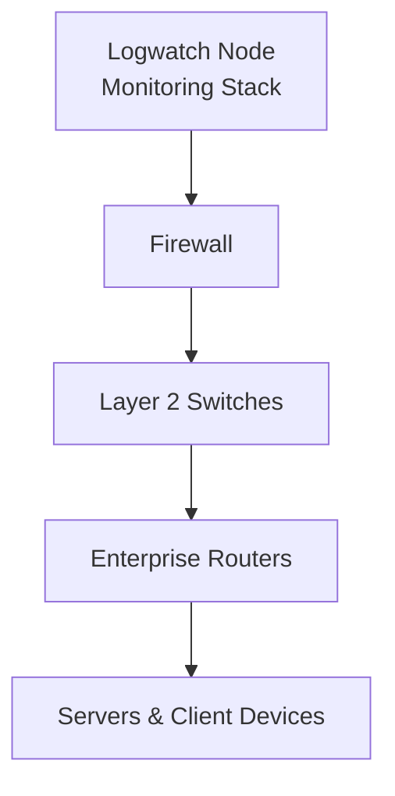

# Topology Definitions

The project uses **Containerlab**'s YAML-based topology definition format (`.clab.yml`) to define the virtual network. This file acts as a *manager*, telling Docker which containers to start and how to link their network interfaces.

---

## File Structure

A standard topology file in is organized into two primary sections: `nodes` and `links`.

```yaml
name: virtual-env

topology:
  nodes:
    # Node definitions ...
  links:
    # Link definitions ...
```

### Nodes

The `nodes` section defines every device in the network. Each entry specifies:

!!! note "Mandatory & Optional"
    Mandatory &rarr; **M**
    Optional &rarr; **O**

- `kind` [M]: The type of node (e.g., `linux` for standard containers, `arista_ceos` for switches). The kind must be supported by Containerlab.
- `image` [M]: The Docker image to use (e.g., `frr_vntd:latest`, `kali_vntd:latest`).
- `startup-config` [O]: Provide startup configuration that the node applies on boot.
- `binds` [O]: Files from the host's device that are mounted into the container to inject configurations.
- `exec` [O]: Commands to run immediately after the container starts (useful for IP assignment).
- `env` [O]: Environment variables (e.g., enabling `SSH_SERVER`).
- `dns` [O]: Used to assign a DNS server address easily, accompanied usually of `servers` with a list of all addresses.

!!! example "Exec & Binds interaction"
    `exec` and `binds` are commonly used together to inject configuration files into the container and then execute such scripts upon startup.

Additional sections definitions can be added to change the behavior and capabilities of devices to easily test the behavior under high-stress environments:

- `cpu` [O]: Define a maximum number of CPU cores to be assigned to a specific node. (e.g., `2`)
- `memory` [O]: Maximum amount of RAM available to a single node. (e.g., `4GB`)

### Example: Internet Router

```yaml
router_internet:
  kind: linux
  image: frr_vntd:latest
  binds:
    - ./config/router/daemons:/etc/frr/daemons
    - ./config/router/internet/frr.conf:/etc/frr/frr.conf
```

### Example: Internet Server

```yaml
internet_server:
  kind: linux
  image: server_vntd:latest
  env:
    WEB_SERVER: 1
    SSH_SERVER: 1
    DNS_SERVER: 1
  binds:
    - ./config/server/dns/internet/dnsmasq.conf:/etc/dnsmasq.conf
  exec:
    - ip addr add 172.16.100.100/24 dev eth1
    - ip link set eth1 up
    - ip route del default
    - ip route add default via 172.16.100.1
```

### Example: Attacker

```yml
attacker:
  kind: linux
  image: kali_vntd:latest
  exec:
    - ip addr add 10.0.0.2/24 dev eth1
    - ip link set eth1 up
    - ip route del default
    - ip route add default via 10.0.0.1
  dns:
    servers:
      - 172.16.100.100
```

### Links
The `links` section defines the virtual cables connecting the nodes. Each link is defined by a pair of endpoints in the format `"node_name:interface_name"`.

### Example: Connecting Internet Router to Enterprise Router

```yaml
links:
  - endpoints: ["router_internet:eth3", "router_enterprise:eth1"]
```

---

## Runtime Artifacts

When a topology is deployed, Containerlab creates a directory named `clab-<topology_name>` (e.g., `clab-virtual-env`).

This directory contains:

- Generated certificates
- Node-specific runtime data
- Node configuration files

!!! warning "Artifacts persistence"
    The `clab-virtual-env` directory is **not permanent** and managed by Containerlab. Do **not** store permanent configurations here, as they may be wiped on redeployment. Always use the `config/` directory for persistent data or any other directory of your choice.

---

## Startup Dependencies

Complex environments may require a **controlled startup order** to ensure that services start only after the required infrastructure is available.

Containerlab allows defining these dependencies using **groups**, **stages**, and **healthchecks**.

This project uses this mechanism to guarantee that critical infrastructure components start in a specific order.

### Health Checks

A **healthcheck** verifies that a container is operational before allowing other components to start.

Example used in the monitoring node:

```yaml
groups:
  watcher:
    healthcheck:
      test:
        - CMD-SHELL
        - ip addr show dev eth1 | grep "$IP_ADDR"
      start-period: 15
      interval: 5
      timeout: 3
      retries: 20
```

This check ensures that the container:
- Has started successfully.
- Has assigned the expected IP address.

Only after this validation is successful the dependent nodes are allowed to continue with the startup process

### Startup Stages

Startup stages define deployment dependencies between nodes.

Example:

```yaml
groups:
  switches:
    stages:
      create:
        wait-for:
          - node: logwatch
            stage: healthy
```

This specific configuration ensures:

1. The `logwatch` node must start first.
2. Containerlab waits until the healthcheck succeeds.
3. Only then are switches and other infrastructure nodes created.

This prevents scenarios where the network nodes are up before the monitoring node is ready.

### Startup Order in the VNTD Topology

The topology follows this startup order:

| Stage | Components                                  |
|-------|---------------------------------------------|
| 1     | Monitoring node (logwatch)                  |
| 2     | Core infrastructure (firewall and switches) |
| 3     | Routers                                     |
| 4     | End hosts                                   |

This ordering ensures that monitoring and infrastructure services are fully operational before user traffic is generated.

---

## YAML Anchors

To reduce duplication in the topology definition file, the project uses YAML anchors. These allow defining reusable configuration templates that can later be referenced multiple times.

Example:
```yaml
pc_template: &user_pc
  kind: linux
  group: hosts
  image: alpine_vntd:latest
  env:
    DHCP_CLIENT: 1
```

Nodes can later inherit the configuration using:
```yaml
pc_vlan50_1:
  <<: *user_pc
  binds:
    - ./config/pc/mutt/enterprise/alice:/root/.mutt/muttrc
```

!!! important "Anchor overwrite value"
  When a node uses an anchor, its values / settings can be overwritten by simply setting a new value in the already defined parameter.

This technique provides the benefits of:
- Reduced duplicated configuration.
- Simplified maintenance.
- Consistency across multiple nodes.

---

## Why Anchors Instead of Groups or Kinds 

Although Containerlab provides **groups** and **kinds** support, they serve different purposes and cannot be fully customized.

### Groups

Allow assigning common runtime behaviour such as startup stages and health checks.

However, a node can belong to **only one group**.

Therefore, groups are mainly used for **deployment management**. These are not intended for creating templates.

Devices are assigned to a specific group:

| Group        | Description                 | Nodes                                                |
|--------------|-----------------------------|------------------------------------------------------|
| **watcher**  | Threat detection and Logs   | `logwatch`                                           |
| **switches** | Enterprise core devices     | `switch_*`, `firewall`                               |
| **routers**  | All routers available       | `router_*`                                           |
| **hosts**    | Servers and users connected | `*_server`, `attacker`, `benign`, `pc_admin`, `pc_*` |

### Kinds

Kinds represent predefined node types supported by Containerlab, such as:
- `linux`
- `arista_ceos`

These are **hard-coded platform defined** and cannot easily be extended with common user configurations.

Therefore, they are not suitable for reusable topology templates.

### YAML Anchors

YAML anchors provide a **configuration reuse mechanism** independent from Containerlab.

They allow:
- Defining templates for common nodes
- Keeping topology file compact
- Avoiding inconsistencies between nodes

Therefore, the project uses anchors for reusable cofigurations, groups for startup orchestration and stages for startup order definition.

---

## Topology Startup Flow

In complex environments, the order in which nodes are initialized can significantly affect the environment.
Some nodes depend on components that must already be operational.

In the provided enterprise topology, the monitoring system must be ready before traffic starts. Therefore, it must be the first node to be available, and the rest should start progressively.

To handle these dependencies, the topology defines a **structured startup flow** using Containerlab orchestration configurations.

### Deployment

The startup sequence implemented in the topology is:



The monitoring device is started first so it can begin analyzing traffic immediately. Next, the connectivity nodes are launched to bring up the core infrastructure and allow the monitoring node to start receiving cloned messages. Finally, the end nodes are started once the core nodes start to become operational.

This sequence ensures that the monitoring node can capture and process as many logs as possible.

---

## Additional Resources

Here are some additional resources that may help create and manage custom topology definition files:

- Containerlab Supported Kinds: [Containerlab](https://containerlab.dev/manual/kinds/)
- Containerlab Topology Definition: [Containerlab](https://containerlab.dev/manual/topo-def-file/)
- Containerlab Nodes: [Containerlab](https://containerlab.dev/manual/nodes/)
- Containerlab Lab Directory and Configuration Artifacts: [Containerlab](https://containerlab.dev/manual/conf-artifacts/)
