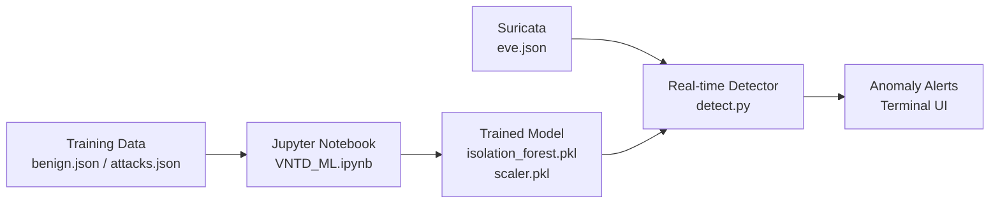

# Machine Learning Overview

The **ML module** is the intelligence layer of the VNTD project. Its purpose is to detect anomalous network behaviour directly from **Suricata-generated logs**, without relying on predefined signatures or rules.

The module is based on an **Isolation Forest** model trained exclusively on benign traffic. Anything that deviates significantly from that baseline is flagged as an anomaly.

---

## Architecture



---

## Directory Structure

```
ml/
├── data/                     # (Git LFS)
│   ├── attacks.json          # ~300.000 attack events (DoS, port scan, SSH brute force...)
│   └── benign.json           # ~240 normal traffic events used for training
├── models/
│   ├── isolation_forest.pkl  # Trained Isolation Forest model (Git LFS)
│   ├── scaler.pkl            # StandardScaler fitted on benign data (Git LFS)
│   ├── model_threshold.txt   # Anomaly score threshold derived at training time
│   ├── confussion_matrix.png
│   ├── feature_distributions.png
│   ├── roc_curve.png
│   ├── score_distribution.png
│   └── time_window_distributions.png
├── notebooks/
│   └── VNTD_ML.ipynb         # Jupyter notebook: full training and evaluation pipeline
├── realtime/
│   ├── detect.py             # Interactive terminal detector (curses UI)
│   └── pipeline.py           # Data processing and model inference logic
└── requirements.txt          # Python dependencies
```

!!! note "Git LFS"
    The `.pkl` model files and `.json` data files are tracked with **Git Large File Storage (LFS)** due to their size. Ensure `git lfs` is installed and pulled before use.

---

## Section Contents

<div class="grid cards" markdown>

-   :material-database:{ .lg .middle } **Data**

    ---

    Training and evaluation datasets extracted from the Suricata IDS.
    [Explore Data](./data.md)

-   :material-folder-cog-outline:{ .lg .middle } **Models**

    ---

    Pre-trained model objects and evaluation charts saved during the last training run.
    [Explore Models](./models.md)

-   :material-notebook-outline:{ .lg .middle } **Notebook**

    ---

    Step-by-step walkthrough of the full ML pipeline: data loading, feature engineering, training, and evaluation.
    [Explore Notebook](./notebook.md)

</div>

---

## Setup & Usage

Before using the ML module (both for training and real-time detection), the required Python environment must be configured.

See the [ML Environment Setup](../installation.md#ml-environment) for full instructions on installing Python, creating the virtual environment, and installing the dependencies listed in `requirements.txt`.

To launch the **real-time detector**, use the `run.sh` main menu or the dedicated ML scripts:

```bash
sudo ./run.sh
# > ML Anomaly Detection
```

See [Scripts - ML](../scripts/ml.md) for more details.
