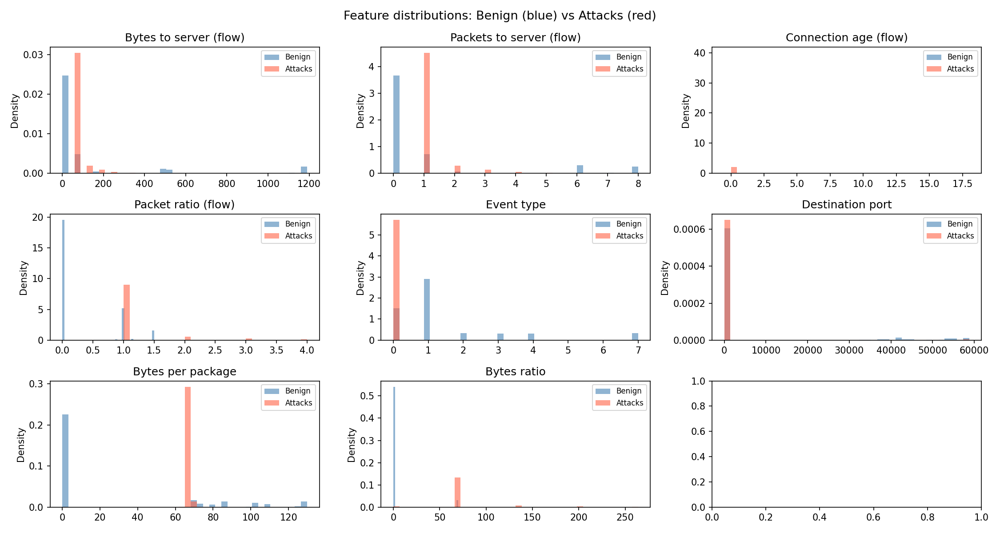
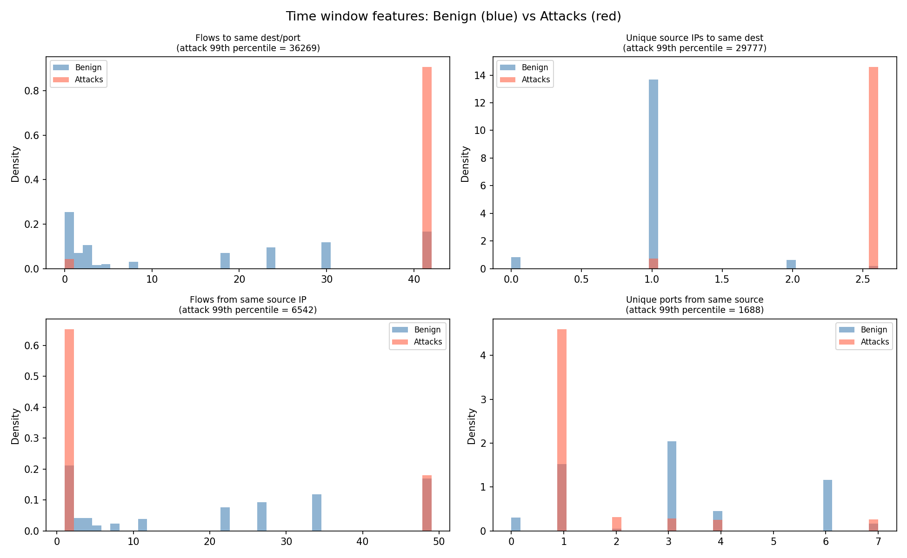
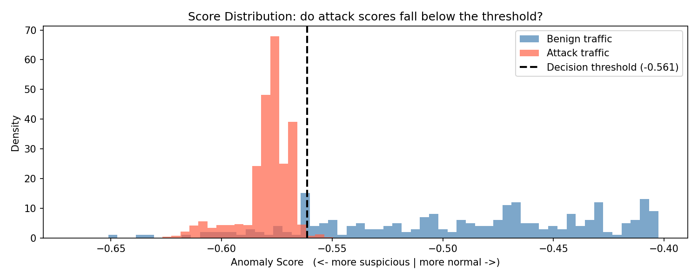
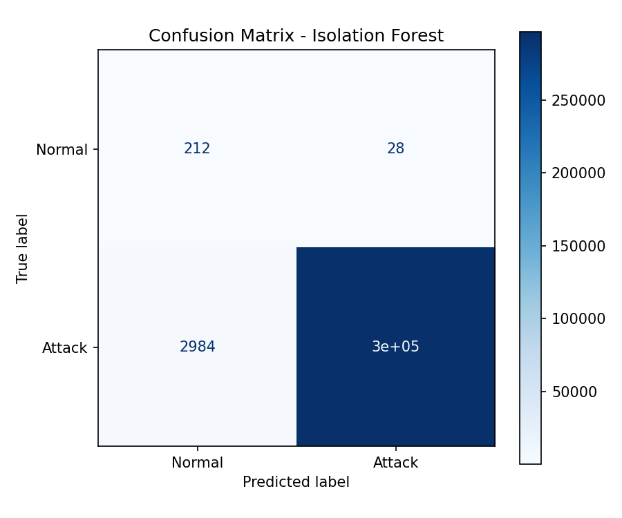
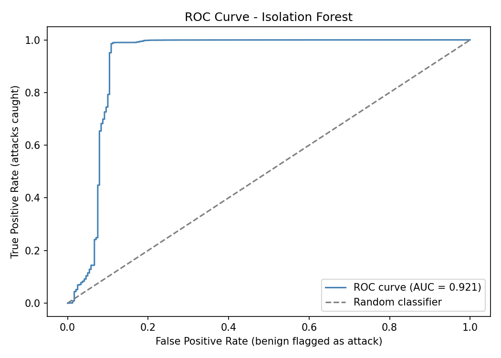

# Notebook - ML Pipeline Walkthrough

The notebook `ml/notebooks/VNTD_ML.ipynb` contains the **full Machine Learning pipeline**. From raw Suricata logs to a trained and evaluated Isolation Forest model.

```
ml/notebooks/
└── VNTD_ML.ipynb
```

This page documents every step in the notebook in detail: what it does, why each decision was made, and what the outputs mean.

## Running the Notebook

For environment setup instructions (Python, virtual environment, Jupyter), see [ML Environment Setup](../installation.md#ml-environment).

Once the environment is active:

```bash
cd ml/notebooks
jupyter notebook VNTD_ML.ipynb
```

The notebook can be opened in the browser at `http://localhost:8888`. Run all cells automatically, or one by one individually.

!!! warning "Run in order"
    Each cell depends on the previous ones. Always run from the top. If you re-run a single cell out of order, the DataFrames may be in an unexpected state.

!!! tip "Large file"
    `attacks.json` is large (~300,000 events). Steps 1 and 10 may take 10–30 seconds to process depending on the host hardware.

---

## Overview

The notebook teaches the model what **normal traffic looks like** using only benign data, then asks it to evaluate all traffic. Anything that deviates significantly from normal is flagged as an anomaly.

```mermaid
flowchart LR
    A[benign.json\n~240 events] --> B[Load + Flatten JSON]
    B --> C[Explore Data]
    C --> D[Encode Text Fields]
    D --> E[Add Derived Features]
    E --> F[Add Time-Window Features]
    F --> G[Select Features]
    G --> H[Scale with StandardScaler]
    H --> I[Train Isolation Forest]
    I --> J[Save Model + Scaler]
    J --> K[Build Evaluation Dataset]
    K --> L[Score + Predict]
    L --> M[Evaluate Results\nCharts + Metrics]
```



### Files Used

| File                | Purpose                                                  |
|:--------------------|:---------------------------------------------------------|
| `data/benign.json`  | ~240 normal events -> used to **train** the model        |
| `data/attacks.json` | ~300,000 attack events -> used to **evaluate** the model |

### Why Train Only on Benign Data?

`attacks.json` contains approximately 300,000 events, the vast majority being SYN flood packets from a DoS attack. Training on that data would teach the model that DoS floods are *normal*. By training exclusively on the 240 benign events, the model learns a the behaviour of legitimate ones. Everything that deviates significantly is then suspicious.

---

## Step 0 - Configure Settings

The first cell defines which Suricata event types to **exclude** before loading.

```python
EXCLUDE_TYPES = {
    "alert",
    # "anomaly",
    # "fileinfo",
}
```

`alert` events are excluded by default because Suricata has already applied a detection rule to them. Including those events would give the model unfair information about known attacks; it would be learning from pre-labelled data rather than discovering patterns on its own.

The other types (`anomaly`, `fileinfo`) are commented out and can be included or excluded to experiment with different training inputs.

---

## Step 1 - Load the Data

Suricata writes logs as **JSON Lines**: one JSON object per line. Each line is parsed and then **flattened** so that nested dictionaries become simple column names.

**Before flattening:**
```json
{
  "event_type": "flow",
  "src_port": 38018,
  "flow": { "pkts_toserver": 2, "age": 0, "state": "new" },
  "tcp": { "syn": true, "rst": true }
}
```

**After flattening:**
```
event_type             flow
src_port               38018
flow_pkts_toserver     2
flow_age               0
flow_state             new
tcp_syn                True
tcp_rst                True
```

Different event types have different fields. A `dns` event has no `flow_*` fields; a `flow` event has no `dns_*` fields. Columns that don't apply to a given event type become `NaN`. These are filled with `0` before training.

---

## Step 2 - Explore the Raw Data

Before building anything, the raw data is inspected per event type to understand what differences already exist between benign and attack traffic:

- **Flow events** - Attack flows show dramatically lower `flow_bytes_toclient` vs benign, and much lower `flow_age`. The server barely responds because it is being flooded.
- **HTTP events** - Attack traffic generates status codes `405` and `404` (method not allowed, not found), while benign HTTP returns `200`.
- **DNS events** - Both datasets have roughly equal numbers of queries and answers, so DNS direction alone is not a strong discriminator.
- **SSH, SMTP, TLS, anomaly** - Their presence or absence is noted but they contain no dominant numeric patterns for this particular dataset.

!!! note "Numeric fields only"
    `.describe()` is called on numeric columns only. Text fields (IPs, hostnames, domain names) are not analysed here because they will either be excluded or encoded in the next step.

---

## Step 3 - Encode Text Fields as Numbers

ML models only understand numbers. Several Suricata fields are text strings and must be mapped to integer codes.

### Encoding Maps

| Column             | Values -> Codes                                                                                 |
|--------------------|-------------------------------------------------------------------------------------------------|
| `event_type_num`   | `flow=0`, `dns=1`, `http=2`, `smtp=3`, `anomaly=4`, `ssh=5`, `tls=6`, `fileinfo=7`, `netflow=8` |
| `proto_num`        | `ICMP=1`, `TCP=6`, `UDP=17`, `IPv6-ICMP=58`                                                     |
| `dns_type_num`     | `query=0`, `answer=1`                                                                           |
| `flow_state_num`   | `closed=0`, `established=1`, `new=2`, `syn_sent=3`                                              |
| `flow_reason_num`  | `fin=0`, `rst=1`, `timeout=2`, `forced=3`                                                       |
| `dns_rcode_num`    | `NOERROR=0`, `NXDOMAIN=1`, `REFUSED=2`, `SERVFAIL=3`                                            |
| `tcp_syn`          | Boolean TCP SYN flag -> `0` / `1`                                                               |
| `tcp_fin`          | Boolean TCP FIN flag -> `0` / `1`                                                               |
| `tcp_ack`          | Boolean TCP ACK flag -> `0` / `1`                                                               |
| `tcp_rst`          | Boolean TCP RST flag -> `0` / `1`                                                               |

Fields that only exist for certain event types (e.g. `flow_state` is only on `flow` events) are encoded **partially**: rows where the field is absent remain `NaN` until filled with `0` later.

---

## Step 4a - Derived Features

Three new columns are computed from the existing flow statistics to make common attack patterns more visible as single numbers.

| Feature         | Formula                                          | Signal                                                 |
|-----------------|--------------------------------------------------|--------------------------------------------------------|
| `bytes_per_pkt` | (total bytes) ÷ (total packets)                  | Low value -> scan traffic (tiny scan packets)          |
| `pkt_ratio`     | `flow_pkts_toserver` ÷ `flow_pkts_toclient`      | High value -> DoS (server receives but barely replies) |
| `bytes_ratio`   | `flow_bytes_toserver` ÷ `flow_bytes_toclient`    | High value -> heavily asymmetric traffic (DoS / scan)  |

For non-flow events (DNS, HTTP…), the `flow_*` columns are `NaN` and both numerator and denominator become 0, so these derived features are 0 for those rows. Division by zero is prevented by `clip(lower=1)`.

---

## Step 4b - Time-Window Features

The features above evaluate each event **in isolation**. But many attacks are not anomalous as a single packet but rather anomalous in **volume**.

- A single SYN packet to port 80 is completely normal.
- 100,000 SYN packets to port 80 in 30 seconds is a DoS flood.

Time-window features count how many **similar events occurred close in time**.

| Feature                           | What it counts                                        | Detects                    |
|-----------------------------------|-------------------------------------------------------|----------------------------|
| `flows_to_dest_port_wndw`         | Flows to the same destination IP + port in the window | DoS flood                  |
| `unique_srcs_to_dest_wndw`        | Unique source IPs targeting the same destination      | Distributed scan / DDoS    |
| `flows_from_src_wndw`             | Total flows from the same source IP in the window     | Port scan / brute force    |
| `unique_dest_ports_from_src_wndw` | Unique destination ports contacted by same source     | Port scan pattern          |

The time window is **30 seconds**. Events are sorted by `timestamp`, and later grouped and counted.

!!! info "Why 30 seconds?"
    A 30-second window is wide enough to capture the pattern of a port scan or DoS burst, but narrow enough to avoid counting completely unrelated traffic. Not too large, not too small.

---

## Step 5 - Visualise Feature Distributions

Before selecting features, the distributions of several key columns are visualised side by side for benign vs attack data.

The charts saved to `ml/models/` (see [Models](./models.md)) show where the two classes differ clearly. Features with large distribution gaps are the most valuable for the model.





**Key observations visible in the charts:**

- `flows_to_dest_port_wndw` - attack traffic shows extremely high counts (thousands) vs benign (single digits).
- `flows_from_src_wndw` - same pattern from the source side.
- `bytes_per_pkt` - attack SYN packets have very low byte counts; benign traffic has a wider range.

---

## Step 6 - Select Features

26 features are selected from all the columns created in the previous steps. The selection covers all major signal types:

```python
FEATURES = [
    # --- all events ---
    "event_type_num",       # type of event: flow=0, dns=1, http=2...
    "proto_num",            # TCP=6, UDP=17, ICMP=1...
    "src_port",             # source port
    "dest_port",            # destination port
    # --- flow events ---
    "flow_state_num",       # connection state
    "flow_reason_num",      # why the flow ended
    "flow_pkts_toserver",   # packets sent to server
    "flow_pkts_toclient",   # packets sent back to client
    "flow_bytes_toserver",  # bytes sent to server
    "flow_bytes_toclient",  # bytes sent back to client
    "flow_age",             # connection duration
    # --- derived from flow ---
    "bytes_per_pkt",        # avg bytes per packet
    "pkt_ratio",            # packet asymmetry
    "bytes_ratio",          # byte asymmetry
    # --- TCP flags ---
    "tcp_syn",              # connection initiation
    "tcp_fin",              # clean close
    "tcp_ack",              # acknowledgement
    "tcp_rst",              # forced rejection
    # --- HTTP events ---
    "http_status",          # 200, 404, 500...
    "http_length",          # response body size
    # --- DNS events ---
    "dns_type_num",         # 0 = query, 1 = answer
    "dns_rcode_num",        # response code
    # --- time window features ---
    "flows_to_dest_port_wndw",
    "unique_srcs_to_dest_wndw",
    "flows_from_src_wndw",
    "unique_dest_ports_from_src_wndw",
]
```

Any feature column that does not exist in a given DataFrame (because no events of that type were present) is created as `NaN` and later filled with `0`.

### Why Ports and Not IP Addresses?

IP addresses are explicitly excluded from the feature list. In an Isolation Forest, all features are treated as numeric magnitudes. IP addresses like `192.168.10.10` and `10.0.0.2` carry no meaningful numeric relationship. A high IP number does not mean a more dangerous connection. Using raw IP values would force the model to weight them by their numeric values, producing unclear results.

**Ports are different.** They carry real information: port 22 is SSH, port 80 is HTTP, port 53 is DNS. Concentrated traffic to a single port signals a targeted attack. Traffic scattered across thousands of ports signals a port scan. These are exactly the patterns an Isolation Forest can exploit.

IP addresses are therefore deliberately excluded from the feature set.

---

## Step 7 - Scale the Features

Before training, all features are normalised using `StandardScaler`.

Features have very different value ranges. `flow_bytes_toserver` can reach thousands; `tcp_syn` is always 0 or 1. Without scaling, the model would only consider large-magnitude features and would ignore low-range ones.

`StandardScaler` transforms each feature to have **mean = 0** and **standard deviation = 1**.

```python
scaler = StandardScaler()
benign_features_scaled = scaler.fit_transform(benign_features)
```

!!! warning "Fit only on benign data"
    `fit_transform()` is called **only on the benign training data**. This ensures that the scaling statistics (mean, std) are learned from normal traffic. The attack data and all future real-time events are transformed with `scaler.transform()` using those same benign statistics.

    If `fit_transform()` was called on an attack or combined dataset, the scaler would be distorted by the attack traffic. The model would then not know what "normal" looks like.

---

## Step 8 - Train the Isolation Forest Model

The Isolation Forest is trained **exclusively on the scaled benign features**.

```python
model = IsolationForest(
    n_estimators=12000,
    max_samples="auto",
    max_features=0.6,
    contamination=0.12,
    random_state=42,
    n_jobs=-1
)
model.fit(benign_features_scaled)
```

### Parameter Rationale

| Parameter       | Value   | Why                                                          |
|-----------------|---------|--------------------------------------------------------------|
| `n_estimators`  | 12,000  | High tree count -> more stable, consistent anomaly scores    |
| `max_samples`   | `auto`  | Each tree uses `min(256, n_samples)`, standard default      |
| `max_features`  | 0.6     | 60% of features per tree -> adds diversity between trees     |
| `contamination` | 0.12    | ~12% of training events assumed to be slightly unusual       |
| `random_state`  | 42      | Ensures reproducibility across training runs                 |
| `n_jobs`        | -1      | All CPU cores used -> faster training                        |

The `contamination` parameter directly controls where the decision threshold (`offset_`) is placed. A value of 0.12 means the model believes up to 12% of the training data to be abnormal and will set the threshold such that approximately that proportion is flagged.

After training, the decision threshold is printed:
```
Decision threshold (offset_): -0.5614
-> Any event with score BELOW this threshold is flagged as an anomaly
```

---

## Step 9 - Save the Model

Both the scaler and the model are stored on the device using **joblib** so that the real-time detector can load them without retraining from scratch.

```python
joblib.dump(scaler, "../models/scaler.pkl")
joblib.dump(model,  "../models/isolation_forest.pkl")

with open("../models/model_threshold.txt", "w") as f:
    f.write(str(model.offset_))
```

Three files are saved:

| File                     | Contents                                      |
|--------------------------|-----------------------------------------------|
| `scaler.pkl`             | Fitted StandardScaler object                  |
| `isolation_forest.pkl`   | Trained Isolation Forest object               |
| `model_threshold.txt`    | Numeric threshold value as a plain text float |

---

## Step 10 - Build the Evaluation Dataset

To evaluate the model, a **labelled dataset** is needed: including known benign events (label `0`) and known attack events (label `1`).

The two DataFrames already loaded in Step 1 are reused. A `_label` column is added to each and they are concatenated:

```python
df_benign["_label"] = 0
df_attack["_label"] = 1
df_all = pd.concat([df_benign, df_attack], ignore_index=True)
```

The same 26 features are extracted, missing values are filled with `0`, and `scaler.transform()` (not `fit_transform`) is called to scale using the benign training statistics.

---

## Step 11 - Predictions

The trained model is asked to classify every event in the evaluation dataset.

Two outputs are produced:

- **`predict()`** - binary decision per event: `1` (normal) or `-1` (anomaly).
- **`score_samples()`** - a continuous anomaly score; more negative = more suspicious.

---

## Step 12a - Score Distribution Diagnostic

Before looking at accuracy metrics, a **visual check** is made to confirm the model has learned meaningful separation.

The anomaly scores for benign events and attack events are plotted as histograms. The decision threshold appears as a dashed vertical line.

**What to look for:**

- Attack scores should cluster to the **left** (more negative) of the benign scores.
- A visible **gap** between the two distributions indicates strong separation.
- Heavy overlap means the model will struggle to distinguish the two classes.

The chart is saved to `ml/models/score_distribution.png`.



With the current model the benign mean score is approximately **-0.491** and the attack mean is approximately **-0.579**, with the threshold at **-0.561**. The distributions partially overlap at the boundary, which explains the false positive and false negative rates seen in the following confusion matrix.

## Step 12b - Classification Report

This step prints a standard classification report summarising the models performance using the current decision threshold.

**What the Metrics Mean:**
- **Precision** - Of all events flagged as attacks, how many were actually attacks.
- **Recall** - Of all real attacks, how many were correctly detected.
- **F1-score** - A balance between precision and recall.

### Result Interpretation

```
Normal -> Precision: 0.07 | Recall: 0.88
Attack -> Precision: 1.00 | Recall: 0.99
```

- The model detects **almost all attacks** (high recall: `0.99`)
- When it flags an attack, it is **almost always correct** (precision: `1.00`)
- However, many benign events are incorrectly flagged as attacks, this is why Normal precision is low (`0.07`)

<!---
Precision (Normal) ≈ 211 / (211 + 3000) ≈ 0.07
-->

The model is **biased** toward detecting attacks, even at the cost of false positives. It **prioritise catching malicious activity over being conservative**.

!!! question "Well trained model, or too much of the same?"

    The very high performance on attack detection should be interpreted carefully.

    The evaluation dataset is **heavily dominated by an attack pattern** (DoS flood traffic). Out of ~300,000 events, the vast majority follow the same behaviour: repeated SYN packets targeting the same destination.

    This makes the task easier for the model:

    - The attack pattern is extremely consistent.
    - The volume-based features (time-window counts) become very strong signals.
    - Even simple thresholds can separate normal vs attack traffic effectively.

    As a result, the model appears highly precise and accurate in this specific scenario.

    However, this does **not necessarily mean the model generalises well**:

    - Different types of attacks (e.g. low-and-slow scans, data exfiltration)
    - More balanced or realistic traffic distributions
    - Environments where attack patterns are less uniform

    In short:  
    The model is **effective for this dataset**, but its performance is partially driven by the **repetitive nature of the attacks**, not just its ability to detect all possible anomalies.

---

## Step 13 - Model Evaluation

Standard classification metrics are computed using scikit-learn.

### Confusion Matrix

```
                Predicted Normal   Predicted Anomaly
Actual Normal        TN                  FP
Actual Attack        FN                  TP
```

The confusion matrix is saved to `ml/models/confussion_matrix.png`.



### Metrics

| Metric      | Description                                               |
|-------------|-----------------------------------------------------------|
| Precision   | Of all events flagged as anomalies, how many were attacks |
| Recall      | Of all attack events, how many were correctly flagged     |
| F1-score    | Harmonic mean of precision and recall                     |
| Accuracy    | Overall fraction of correctly classified events           |

## Step 14 - ROC Curve

The ROC curve plots the **True Positive Rate** (recall) against the **False Positive Rate** across all possible thresholds. The **AUC** (Area Under the Curve) provides a summary score independent of any particular threshold: `1.0` means perfect separation, `0.5` means no better than random.

Saved to `ml/models/roc_curve.png`.



With the current model the AUC is very high, which reflects the same conclusion from the classification report: the attack traffic is heavily dominated by a single, consistent DoS pattern that is easy to separate from benign traffic.
