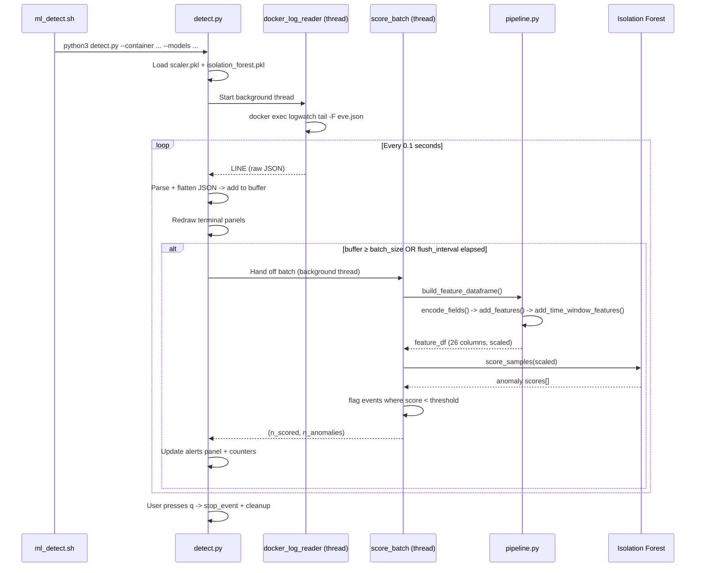

# Real-Time Detector

The `ml/realtime/` directory contains the two Python modules that run the **live anomaly detector**: a terminal-based tool that reads Suricata logs directly from the running `logwatch` container and scores each event on the trained Isolation Forest model.

```
ml/realtime/
├── detect.py     # Terminal UI, main loop, threading
└── pipeline.py   # Data processing and ML inference
```

The separation of concerns is deliberate: `detect.py` owns everything the user sees on screen, and `pipeline.py` owns everything the model needs.

---

## How It Works



---

## detect.py

Main entry point. Handles the terminal UI and coordinates all threads.

### Libraries

| Library      | Why                                                                 |
|--------------|---------------------------------------------------------------------|
| `curses`     | Draws the terminal panels using rows and columns instead of pixels  |
| `threading`  | Runs log reading and scoring in background threads                  |
| `queue`      | Thread-safe communication between the reader, scorer and main loop  |
| `subprocess` | Spawns `docker exec ... tail -F eve.json` to stream live logs       |
| `joblib`     | Loads the `.pkl` model and scaler files from disk                   |
| `argparse`   | Parses command-line arguments passed by `ml_detect.sh`              |

### CLI Arguments

The script is called by `ml_detect.sh` with these arguments:

```bash
python3 detect.py \
    --container      clab-virtual-env-logwatch \
    --models         /path/to/ml/models \
    --batch          5000 \
    --flush-interval 30 \
    --eve-log        /var/log/suricata/eve.json \
    --threshold      -0.5614
```

| Argument           | Default                          | Description                                                                     |
|--------------------|----------------------------------|---------------------------------------------------------------------------------|
| `--container`      | *(required)*                     | Name of the Docker container running Suricata                                   |
| `--models`         | *(required)*                     | Path to the directory with `scaler.pkl` and `isolation_forest.pkl`              |
| `--threshold`      | `None`                           | Anomaly score cutoff. Falls back to `model_threshold.txt`, then `model.offset_` |
| `--batch`          | `50`                             | Score when this many events have accumulated                                    |
| `--flush-interval` | `30`                             | Also score after this many seconds even if buffer isn't full                    |
| `--eve-log`        | `/var/log/suricata/eve.json`     | Path to the Suricata log file inside the container                              |

### Threshold Priority

The anomaly threshold is resolved in this order; the first source that provides a valid value wins:

```
1. --threshold (CLI argument)
2. ml/models/model_threshold.txt
3. model.offset_  (read from the loaded .pkl object)
```

### Terminal Layout

The screen is divided into four panels, stacked vertically:

```
┌─────────────────────────────────────┐
│         [ Live events ]             │  ~1/3 of terminal height
│  green - one line per event         │
├─────────────────────────────────────┤
│         [ Anomaly alerts ]          │  ~1/3 of terminal height
│  red - one block per flagged event  │
├─────────────────────────────────────┤
│         [ Statistics ]              │  ~1/6 (min 7 rows)
│  yellow - runtime counters          │
├─────────────────────────────────────┤
│         [ AI Model ]                │  ~1/6 (min 11 rows)
│  magenta - model parameters         │
└─────────────────────────────────────┘
```

Each panel is drawn by `draw_panel()`, which handles borders, the centred title, and clipping lines that are too long for the terminal width. Panel heights are recalculated on every frame via `calculate_panel_layout()` so resizing the terminal works correctly.

### Background Threads

Two types of background threads keep the UI responsive:

**`docker_log_reader`** - runs for the entire session. Executes `docker exec <container> tail -F <eve.json>` and puts each new line on a `queue.Queue` as a `("LINE", raw_json)` tuple. If Docker crashes or the container stops, it puts an `("ERROR", message)` instead.

**Scoring thread** - spawned on demand. Each time a batch is ready to score, a new `threading.Thread` calls `pipeline.score_batch()` in the background. `scoring_in_progress` prevents a second thread from being spawned while one is already running. Results are returned via a separate `scorer_results` queue and picked up by the main loop.

### Main Loop

The main loop runs every **0.1 seconds**:

1. Check if the user pressed `q` -> break.
2. Drain up to 25,000 items from the log queue per frame.
3. For each `LINE`: parse JSON, skip excluded types, flatten, append to buffer, and add a summary line to the live events panel.
4. Decide whether to score:
    - **Batch full:** `len(buffer) >= batch_size`
    - **Timed out:** `time_since_last_score >= flush_interval` and buffer is not empty
5. If scoring: take the batch, clear those events from the buffer, start a scoring thread.
6. Collect any results from finished scoring threads -> update counters.
7. Redraw all four panels.

---

## pipeline.py

Data processing and ML inference. Contains the same logic as the Jupyter notebook, adapted to run on batches of live events rather than static files.

!!! warning "Keep in sync with the notebook"
    If the model is retrained with different features or encoding maps, **this file must be updated to match**. The `FEATURES` list, encoding maps, and `EXCLUDE_TYPES` must be identical to what was used during training.

### Functions

#### `flatten_json(event)`
Converts a nested Suricata JSON event into a flat dictionary. Nested keys become `parent_child` column names (e.g. `flow.pkts_toserver` -> `flow_pkts_toserver`). This is Step 1 of the notebook.

#### `encode_fields(df)`
Maps text fields to numeric codes using the encoding maps defined at the top of the file (Step 3). Fields that don't apply to a given event type remain `NaN`.

#### `add_features(df)`
Computes the three derived ratio features from flow statistics (Step 4a): `bytes_per_pkt`, `pkt_ratio`, `bytes_ratio`. Division by zero is handled by clipping the denominator to a minimum of 1.

#### `add_time_window_features(df)`
Groups events into 30-second windows and computes the four volume-based counters (Step 4b): `flows_to_dest_port_wndw`, `unique_srcs_to_dest_wndw`, `flows_from_src_wndw`, `unique_dest_ports_from_src_wndw`.

#### `build_feature_dataframe(raw_event_rows)`
Orchestrates the full preprocessing pipeline in order: `encode_fields` -> `add_features` -> `add_time_window_features` -> select the 26 `FEATURES` columns -> fill `NaN` with `0`. Returns both the 26-column `feature_df` ready for the scaler, and the full `events_df` used to build alert display lines.

#### `score_batch(events, scaler, model, threshold, event_log_lines, alert_lines)`
The core of the detector. Calls `build_feature_dataframe()`, scales the result with `scaler.transform()`, scores with `model.score_samples()`, and flags events where `score < threshold`. For each flagged event, it appends an alert line and tries to classify the attack type based on the time-window features:

| Condition                              | Hint shown                              |
|----------------------------------------|-----------------------------------------|
| `flows_to_dest_port_wndw > 100`        | Possible DoS                            |
| `flows_from_src_wndw > 100`            | Possible Brute-force                    |
| `unique_dest_ports_from_src_wndw > 20` | Possible Port scan                      |
| `unique_srcs_to_dest_wndw > 10`        | Possible DDoS                           |
| `tcp_rst == 1`                         | TCP RST - connection forcibly rejected  |
| `dns_rcode == 2`                       | DNS REFUSED                             |
| `dns_rcode == 1`                       | DNS NXDOMAIN                            |

The entire function is wrapped in `try/except/finally`. If anything crashes mid-batch, the error is shown in the live events panel and the buffer is cleared to prevent re-processing the same broken events.

#### `load_threshold(models_dir, cli_threshold)`
Resolves the anomaly threshold following the priority order described above.

#### `convert_int(value)` / `convert_str(value)`
Safe type converters that handle `None`, `NaN`, and other unexpected values without crashing. Used when extracting display fields from events, where many fields are absent depending on event type.

#### `append_lines(line_list, text, max_lines=500)`
Appends a string to a list and trims it to `max_lines` to prevent unbounded memory growth during long sessions.

---

## Relationship with the Notebook

`pipeline.py` is a direct port of the preprocessing steps from `VNTD_ML.ipynb`. The notebook steps map to functions as follows:

| Notebook Step | pipeline.py                                    |
|---------------|------------------------------------------------|
| Step 0        | `EXCLUDE_TYPES`, encoding maps                 |
| Step 1        | `flatten_json()`                               |
| Step 3        | `encode_fields()`                              |
| Step 4a       | `add_features()`                               |
| Step 4b       | `add_time_window_features()`                   |
| Step 6        | `FEATURES` list, `build_feature_dataframe()`   |
| Step 7        | `scaler.transform()` inside `score_batch()`    |
| Step 8        | `model.score_samples()` inside `score_batch()` |

See the [Notebook](./notebook.md) documentation for a full explanation of what each step does and why.
