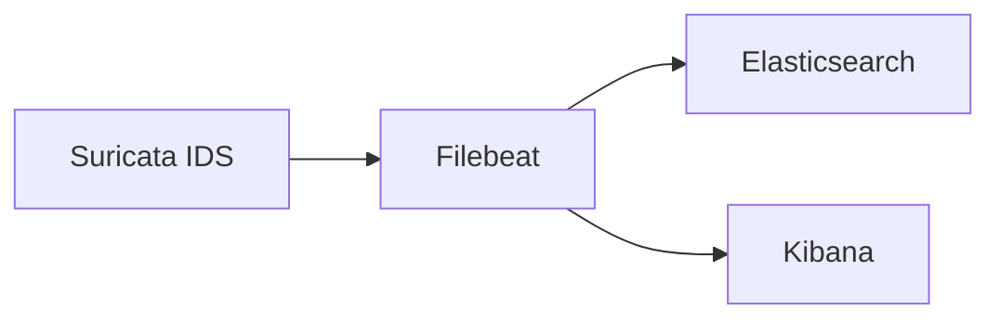

# Filebeat

Filebeat acts as the **bridge between Suricata and Elasticsearch**.

Its function is to recover all generated logs by **Suricata** and send them directly to **Elassticsearch** for later examination and processing.

Therefore, *Filebeat* is responsible for:

- Collecting Suricata logs.
- Parsing structured events.
- Sending data to Elasticsearch.
- Loading dashboards and pipelines.

---

## Architecture

Filebeat operates between the IDS and the data storage service.



Filebeat need to be able to connect with Elasticsearch to generate the data pipelines and send the data. But also with Filebeat to load pre-built dashboards, visualizations and templates.

---

## Service Activation

Filebeat runs only when **both monitoring components are enabled**.

```yaml
env:
    SURICATA_SERVICE: 1
    ELASTIC_STACK: 1
```

If either variable is missing or has a value different than 1, the service won't start.

This ensures Filebeat only runs when both Suricata and analysis tools (Elastic stack) are available.

---

## File Structure and Configuration

Filebeat is configured via two primary files:

=== "filebeat.yml"
    Main configuration file defines the output destination.
    Filebeat and Elasticsearch reside on the same `logwatch` node for simplified management.

=== "suricata.yml"
    Located in `modules.d/`, this file define which services the filebeat is supposed to recover the logs from.

Filebeat configuration file:

```bash
/etc/filebeat/filebeat.yml
```

This file defines:

- Log input paths.
- Elasticsearch output.
- Modules enabled. (In this scenario activated through commands)
- Kibana output.

Bind example:

```yaml
binds:
  - ./config/logwatch/filebeat/filebeat.yml:/etc/filebeat/filebeat.yml
  - ./config/logwatch/filebeat/suricata.yml:/etc/filebeat/modules.d/suricata.yml
```

*See modules file in the next point*

This allows modifying the Filebeat service behavior without rebuilding the container image.

### Configuration Permissions

Configuration files required to run the Filebeat environment requires their permissions to be adjusted.

Required permissions:

> filebeat.yml
- **Owner:** root
- **Permissions:** 600

> suricata.yml
- **Owner:** root
- **Permissions:** 644

Specially, the `filebeat.yml` file. The service refuses to start if the configuration file is writable by other users.

!!! important "Permissions"
    Once the permissions are changed, the user will need to change these manually if he desires to apply changes to the file.
    Permissions 644 are more than enough to apply changes to the specified file.

---

## Modules

Filebeat uses the **Suricata module**. Modules simplify data parsing and include:

- Predefined pipelines.
- Dashboards.
- Index templates.

The included module can be found at:
```bash
/etc/filebeat/modules.d/suricata.yml
```

This file defines the path from where the filebeat recovers the logs to send to Elasticsearch.

To see all available modules, use the command:
```bash
filebeat modules list
```

!!! note "Modules support"
    All supported modules already include a template file within the `modules.d` directory.

The entrypoint automatically enables the module with:

```bash
filebeat modules enable suricata
```

This way, the configuration file needs no additional parameters.

### Log Suricata Sources

Filebeat reads Suricata logs from:

```bash
/var/log/suricata/eve.json
```

This JSON stream contains all the logs recovered by suricata. Which are later parsed and sent structured to Elasticsearch.

---

## Filebeat Setup

Before starting the service, Filebeat runs a setup procedure:

```bash
filebeat setup
```

This command loads several important resources into Elasticsearch:

| Component        | Purpose                 |
|------------------|-------------------------|
| Index templates  | Defines data strutures  |
| Ingest pipelines | Parse incoming logs     |
| Dashboards       | Visualization templates |

In this laboratory, the setup also requires the Elasticsearch administrator credentials to properly create and set up all previous components.

```bash
    filebeat setup \
    -E output.elasticsearch.username=$ELASTIC_USER \
    -E output.elasticsearch.password=$ELASTIC_PASSWORD
```

Once completed, filebeat runs on the defined user specified in the cofiguration file and created on the `entrypoint.sh` script.

---

## Security Considerations

Filebeat requires credentials to communicate with Elasticsearch and be able to download dashboards and services from the official Elastic servers.

!!! important "Official dashboards"
    Security and credentials can be removed/disabled, but doing will prevent the environment from downloading dashboards and other services.

For this reason, a **dedicated internal user** is created:

> filebeat_internal : pswd_vntd

This user has enough permissions to manage and create all necessary elements to parse data into Elasticsearch.

!!! warning "Credentials"
    The credentials are intentionally weak for this laboratory environment to ease the configuration process.

!!! note "Role + Permissions"
    All recommended permissions suggested by the official Elastic documentation plus additional ones recommended by online forums have been added to ensure propper communication between services.
    Please consider study into greater detail which privileges to give the user before copying these settings into a real environment.

---

## Starting Filebeat

Once configuration and setup are completed, Filebeat is started with:

```bash
    filebeat -e -c /etc/filebeat/filebeat.yml &
```

These parameters allow:
- **`-e`:** Logs errors to stderr. This way, logs can be seen using the `docker logs -f <container>` command.
- **`-c`:** Specified the configuration file to use.

Once events reach Elasticsearch, they can be visualized in **Kibana**.

!!! note "Remember"
    Dashboards are automatically installed during the `filebeat setup` phase, no need to create them manually.

---

## Verification

Check Filebeat logs:

```bash
filebeat test output
```

Check whether the configuration is correct:

```bash
filebeat test config
```

---

## Additional Resources

For additional documentation, check the official documentation:

- [Docs - Filebeat](https://www.elastic.co/docs/reference/beats)
