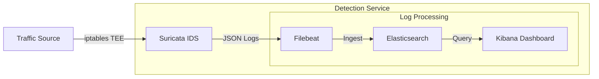

# Monitoring & Threat Detection

The VNTD environment integrates a centralized monitoring system responsible for processing and visualizing network events across the simulated enterprise network.

The monitoring architecture relies on a **single node called `logwatch`**, which integrates several industry-standard open-source tools.

---

## Monitoring Pipeline

The monitoring pipeline follows an architecture designed around logs, where traffic is inspected, transformed into structured events, indexed, and finally visualized.

Ass seen, the node is divided into two primary functional areas:

- IDS that inspects mirrored traffic from the firewall and stores it into registers using the **Suricata** service.
- Centralized logging platform consisting of **Filebeat**, **Elasticsearch** and **Kibana**.

---

## Data Flow

The monitoring process follows several stages:

1. **Traffic Analysis:** Network traffic is mirrored towards the `logwatch`. **Suricata** analyzes packets in real time.
2. **Event Generation:** Suricata generates structured **EVE JSON logs** describing network events.
3. **Log Shipping:** **Filebeat** monitors these log files and forwards them to the storage backend.
4. **Indexing:** **Elasticsearch** stores and indexes events, making them searchable.
5. **Visualization:** **Kibana** provides dashboards and search interfaces for analysts.

### Web Interfaces

Some services expose web interfaces accessible from the host system.

| Service       | Access                     |
|---------------|----------------------------|
| Kibana        | `http://<ip_address>:5601` |
| Elasticsearch | `http://<ip_address>:9200` |

It's recommended to use a web explorer to access both sites, using the IP address generated by *Containerlab* on setup.

---

## Architecture Overview

The monitoring stack deployed in the `logwatch` node consists of four major components:

- [**Suricata**](./suricata.md): Network packet inspection.
- [**Elasticsearch**](./elasticsearch.md): Log storage and indexing.
- [**Kibana**](./kibana.md): Visualization and data exploration.
- [**Filebeat**](./filebeat.md): Log forwarding and parsing.
- [**Alerts & Detection Rules**](./alerts.md): Processing the network data.
