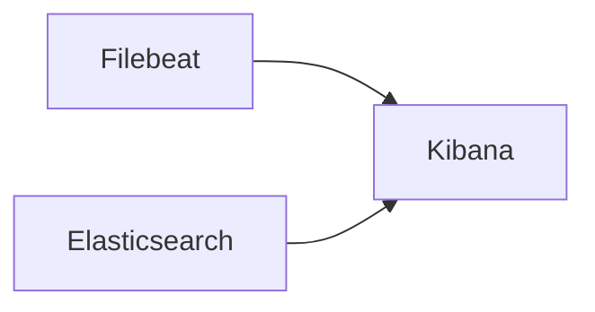

# Kibana

Kibana provides the **web interface** used to visualize and analyze security events.

It connects to **Elasticsearch** to visualize the data stored in it through dashboards and other graphical elements for easy analysis.

Therefore, *Kibana* is responsible for:
- Search network events.
- Inspect IDS registers.
- Visualize dashboards.
- investigate suspicious activity.

---

## Architecture

Kibana works on top of **Elasticsearch** and provides visualization capabilities.



The system allows users to explore network activity captured by the IDS.

---

## Service Activation

Kibana is started only when the following variable is set:

```yaml
env:
    ELASTIC_STACK: 1
```

If the variable is not set, none of the Elastic components (Elasticsearch, Filebeat, Kibana) start.

This allows disabling the full monitoring stack when running the laboratory on lower resource systems

---

## Startup Behaviour

The monitoring container `entrypoint` performs the followign operations:

1. Launch Kibana service.
2. Wait for Elasticsearch availability.
3. Wait until Kibana API returns a healthy status.

Example startup command:
```bash
    su -s /bin/bash kibana -c "/usr/share/kibana/bin/kibana" &
```

The service must be executed using the **kibana** user. This profile is automatically created by the elastic installer and needs no additional manual configuration to use. Hence, the use of `su` (switch user) and the `-s` (use bash as the shell) and `-c` (which operation to execute) parameters.

---

## File Structure and Configuration

Kibana configuration is provided through binds.

Kibana primary configuration file:

```bash
/etc/kibana/kibana.yml
```

This file defines:
- Elasticsearch source definition and credentials.
- Network service properties.
- Addresses to provide service to.

Bind example:

```yaml
binds:
  - ./config/logwatch/kibana/kibana.yml:/etc/kibana/kibana.yml
  - ./config/logwatch/kibana/node.options:/etc/kibana/node.options
```

*See node.options file in the next point*

This allows modifying the Kibana service behavior without rebuilding the container image.

---

### Heap Options

Kibana consumes a significant amount of RAM. By default, it allocates around **4GB** of the memory to Kibana.

Although it does not consume as many resources as its counterpart (Elasticsearch) it still consumes significantly.

Therefore, the amount of RAM consumed by the service can be limited in the `node.options` file.

```bash
/etc/kibana/node.options
```

This file defines the maximum amount of RAM for the Kibana web node. In this laboratory environment, the RAM consumption has been limited to **2GB**, although it can be further reduced to **1GB** given the scale of the environment.

```options
--max-old-space-size=2048
```

The value is represented in `MB`.

---

## Security Considerations

Kibana requires credentials to communicate with Elasticsearch and be able to request data to be displayed to the users.

!!! note "Security"
    To view the reason why credentials have been enabled take a look at [Filebeat](filebeat.md).

A **dedicated internal user** is used. This user is already provided by the system.

!!! note "Kibana user"
    For more information regarding this existing Kibana user, take a look at [Elasticsearch](elasticsearch.md).

> kibana_system | pswd_vntd

!!! warning "Credentials"
    The credentials are intentionally weak for this laboratory environment to ease the configuration process.

---

## Web Access & Verification

The Kibana service publishes a web interface.

Default port:
>5601      #HTTP

Default endpoint:
>http://localhost:5601

```
http://<monitoring-node-ip>:5601
```

The site is intended to be used from a web explorer.

!!! important "monitoring-node-ip"
    To connect to the web site for testing the environment and it's accessibility, use the Containerlab generated IP management address.

### Authentication

Users authenticate using credentials created during container initialization.

For more information on this process, check [Elasticsearch](./elasticsearch.md).

Default credentials:
> admin | 12345aA

This account has `superuser` privileges.

!!! warning "Weak credentials"
    These credentials are intentionally weak and should only be used in isolated and controlled environments.

---

## Dashboards

Dashboards are automatically installed by **[Filebeat](filebeat.md) setup**.

These dashboards include suricata statistics and easy register analysis.

!!! note "Dashboards availability"
    Dashboards are only available if both suricata service and elastic stack are enabled.
    These are automatically created by **Filebeat**.

---

## Additional Resources

For additional documentation, check the official documentation:

- [Docs - Kibana](https://www.elastic.co/docs/reference/kibana)
