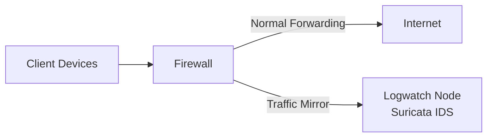

# Suricata

Suricata is the **Network Intrusion Detection System** used within the VNTD laboratory.

The primary purpose of this engine is to record **all** incoming and outgoing network traffic for later processing.

Within the project architecture, Suricata acts as the **first stage of the monitoring stack**, generating structured network events that are later processed by the rest of the monitoring stack. Therefore, it operates as a **passive sensor**.

It receives mirrored traffic from the firewall and analyzes it without interfering with other network operations.

---

## Architecture

The monitoring architecture relies on **traffic mirroring** from the firewall towards the monitoring node.

The firewall duplicates traffic using `iptables TEE` and sends the duplicated packages to the monitoring interface of the `logwatch` container.



---

## Passive Monitoring

The IDS operates strictly in passive mode, this means:
- No packet modification.
- No packets forwarded by the IDS.

!!! important "Promiscuous Mode"
    The monitoring interface needs to be set to promiscuous mode to capture all mirrored traffic received from the firewall.

!!! warning "Monitoring Only"
    The IDS is not configured to block traffic. It operates only as a detection and logging system.

---

## Service Activation

Suricata is started only when the following environment variables are defined:

```yaml
env:
    SURICATA_SERVICE: 1
```

If the variable is not set Suricata does not start and therefore no traffic inspection occurs.

This mechanism allows the monitoring stack to be enabled or disabled easily depending on the lab scenario.

---

### Additional Environment Variables

Additional environment variables are required to start the machine correctly.

```yaml
    IFACE: "eth1"
    IP_ADDR: "192.168.20.10/24"
    IP_GTWY: "192.168.20.1"
```

Although the interface variable is not required to be set (by default, it is set to `eth1`), other variables are necessary to establish a connection with the network topology.

---

## Startup Behavior

When the container starts, the entrypoint script performs the following steps:

1. Waits until the monitoring interface exists.
2. Assigns the configured IP address.
3. Enables promiscuous mode.
4. Launches Suricata in background mode.

Example command executed:

```bash
suricata -c /etc/suricata/suricata.yaml -i eth1
```

| Parameter | Purpose                           |
|-----------|-----------------------------------|
| -c        | Specifies configuration file      |
| -i        | Interface used for packet capture |

---

## File Structure and Configuration

Suricata configuration is provided through binds.

Primary configuration file:

```bash
/etc/suricata/suricata.yaml
```

This file defines:
- Capture interface configuration and capture settings.
- Detection settings.
- Logging outputs.
- App layer protocol configuration.
- Other advanced settings...

Bind example:

```yaml
binds:
  - ./config/logwatch/suricata/suricata.yaml:/etc/suricata/suricata.yaml
```

This allows modifying the Suricata service behavior without rebuilding the container image.

---

### Rules

The rules define the logic used to identify / store network traffic to generate logs accordingly.

!!! note "Rule Updates"
    In this laboratory, environment rules are included with the configuration file.
    Any changes applied to the file will require a service (or environment) restart.

One of the main advantages Suricata offers is its ability to configure the service to detect or ignore traffic from specific protocols, allowing users to only process concrete traffic.

!!! tip "Monitoring Health"
    To verify if Suricata is correctly receiving packets, you can check the statistics log: `tail -f /var/log/suricata/stats.log`.


---

## Log Generation

Suricata generates several log files located in:

```bash
/var/log/suricata/
```

The most relevant feature of Suricata in this lab is the file output. All data is recovered and logged into a single estructured JSON file:
> `eve.json`

Considering the security events are stored in a structured JSON format, it offers seamless integration with the Elastic stack.

Other generated files:

| File           | Purpose                                                                                              |
|----------------|------------------------------------------------------------------------------------------------------|
| `fast.log`     | Human readable alert logs                                                                            |
| `suricata.log` | Engine diagnostic logs, useful to check if the service has started correctly and any possible errors |
| `stats.log`    | Performance metrics, resource utilitzation, packet statistics, engine performance                    |

---

### Using Suricata

Suricata runs automatically once the monitoring container starts.

To inspect generated events manually:

```bash
tail -f /var/log/suricata/eve.json
```

!!! note "JSON"
    It's recommended to use formatting tools such as `jq` to ease the process of reading JSON files.

---

## Lab Security Warning

The IDS configuration is designed for **educational and testing environments**. It prioritizes:
- Simplicity.
- Transparency.
- Easy inspection of network traffic.

!!! warning "Not for Production"
    The configuration used in this laboratory environment should not be deployed in production networks.

---

## Additional Resources

For additional documentation, check the official documentation:

- [Docs - Suricata](https://docs.suricata.io/en/latest/)
