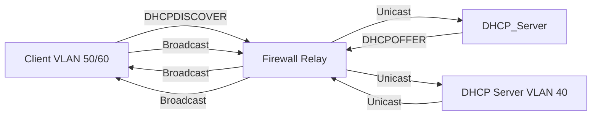

# DHCP Service Design

DHCP is a **core infrastructure service** that enables scalable client connectivity while maintaining strict VLAN isolation and centralized control.

---

## Purpose of DHCP in the Lab

The DHCP service is responsible for:

- Dynamically assigning IP configurations to user endpoints.
- Distributing network parameters consistently.
- Reducing manual configuration on client nodes.
- Simulating real enterprise endpoint behavior.

DHCP is intentionally limited to **user-facing VLANs** and is not used for infrastructure or service nodes.

---

## Centralized DHCP Architecture

The lab implements a **centralized DHCP server model**, where:

- A single DHCP server runs in VLAN 40.
- Multiple user VLANs are served by that server.
- All DHCP traffic traverses the firewall.

This approach reflects common enterprise deployments and simplifies management, logging, and policy enforcement.

### Traffic Flow Logic

---

## Architectural Constraints

The DHCP design is constrained by the following architectural choices:

- **Isolation:** User devices (VLAN 50/60) cannot communicate directly with the server (VLAN 40) but through the firewall.
- **Enforcement:** All DHCP traffic must traverse the firewall, where security policies can be applied.
- **Scope:** DHCP is reserved for user workstations; infrastructure nodes (routers, servers) use static assignments to ensure stability.

Because DHCP relies on broadcast-based discovery, a direct client–server model is not viable.

### Design Benefits

This design provides several advantages:

- **Scalability:** New user VLANs can be added without deploying new DHCP servers.
- **Security:** DHCP traffic is explicitly limited to a specific set of VLANs.
- **Maintainability:** All address pools are defined in a single location.
- **Realism:** Mirrors enterprise DHCP deployments.

!!! tip "Scalability"
    The design makes it easy to add new devices to the domains without modifying the DHCP server logic.

### Role of the Firewall

The firewall plays a critical role in the DHCP architecture:

- Acts as the default gateway for all VLANs.
- Hosts the DHCP **relay agent**.
- Enforces security policies on DHCP traffic.

The firewall forwards all DHCP traffic between the allowed VLANs requesting addresses and the DHCP server.
