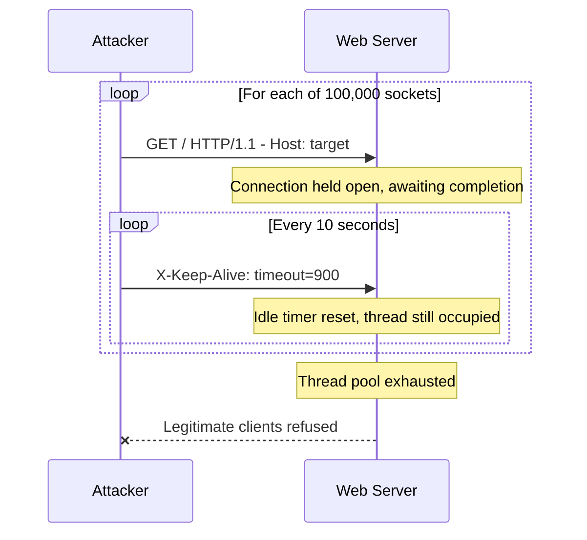

# Slow HTTP DoS (Slowloris)

This scenario performs a **Denial-of-Service (DoS) attack** against the enterprise web server using the Slowloris tool from the attacker container.

Unlike a volumetric flood, Slowloris works by opening a large number of **partial HTTP connections** and sending incomplete headers at an intentional slow rate, keeping each connection alive indefinitely. The server's connection thread pool becomes exhausted, preventing legitimate clients from connecting; without generating excessive network traffic.

---

## Attack Script

Location:
> `scripts/attacks/dos_slow_http_slowloris.sh`

Basic usage:

```bash
./scripts/attacks/dos_slow_http_slowloris.sh clab-virtual-env-attacker
```

With explicit parameters:

```bash
./scripts/attacks/dos_slow_http_slowloris.sh clab-virtual-env-attacker enterprise.com 80 300
```

| Parameter            | Description                    | Default          |
|----------------------|--------------------------------|------------------|
| `attacker-container` | Container executing the attack | required         |
| `target`             | Target hostname or IP          | `enterprise.com` |
| `port`               | Target HTTP port               | `80`             |
| `duration_seconds`   | How long the attack runs       | `120`            |

---

## How Slowloris Works

Slowloris sends HTTP request headers, but never sends the final message that would complete the request. Instead, it periodically sends an additional header to reset the server's idle timeout, keeping the connection open.



---

## Attack Configuration

| Option        | Value       | Purpose                                                 |
|---------------|-------------|---------------------------------------------------------|
| `-p`          | target port | Port to attack                                          |
| `-s`          | `100000`    | Number of concurrent sockets to open                    |
| `--sleeptime` | `10`        | Seconds between sending an incomplete header per socket |

The high socket count ensures the server's connection limit is reached quickly. The 10-second sleep interval keeps each connection alive without triggering timeouts.

---

## Execution Behaviour

The Slowloris process is started in the background and terminated after the configured duration using a two-step sequence:

1. **SIGTERM** - requests a clean shutdown
2. **SIGKILL** - forces termination if the process has not exited after 2 seconds
3. **`wait`** - reaps the child process to prevent zombies

The container runs `tini` as PID 1, which provides additional orphan process cleanup if the shell-level steps above do not fully clear all children.

---

## Observed Effects

- **On the server:** `netstat -ant | grep :80 | wc -l` will show a large number of `ESTABLISHED` or `SYN_RECV` connections from the attacker IP
- **In Suricata / Kibana:** The high connection rate from a single source will trigger threshold alerts. Flow metadata in `eve.json` will show many long-duration flows with minimal bytes transferred

!!! note "Low Bandwidth"
    Because Slowloris sends very little data, it will not appear as a traffic volume spike. Detection relies on connection count and flow duration anomalies rather than byte rate.
