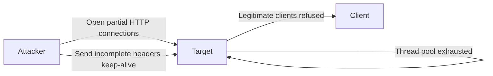

# Slow HTTP DoS (Slowloris)

This scenario performs a **Denial-of-Service (DoS) attack** using Slowloris from an attacker container.

Unlike a flood attack, Slowloris works by opening many **partial HTTP connections** and keeping them alive as long as possible. This exhausts the server's connection thread pool, preventing legitimate clients from connecting, without generating large volumes of traffic.

---

## Attack Script

Location:
> `scripts/attacks/dos_slow_http_slowloris.sh`

Example usage:

```bash
./scripts/attacks/dos_slow_http_slowloris.sh clab-virtual-env-attacker
```

Specify target, port, and duration manually:

```bash
./scripts/attacks/dos_slow_http_slowloris.sh clab-virtual-env-attacker enterprise.com 80 300
```

| Parameter          | Description                                  |
|--------------------|----------------------------------------------|
| attacker-container | Container executing the attack               |
| target             | Target host (optional)                       |
| port               | Target port (optional)                       |
| timeout            | Duration of the attack in seconds (optional) |

!!! note "Default values"
    If no arguments are specified, the script targets: `enterprise.com` on port `80` for `120` seconds.

---

## Attack Configuration

The script runs `slowloris` with the following options:

| Option        | Purpose                                                   |
|---------------|-----------------------------------------------------------|
| `-p`          | Target port                                               |
| `-s`          | Number of concurrent sockets to open                      |
| `--sleeptime` | Seconds to wait between sending partial headers per socket |

The attack opens **100,000 concurrent sockets**, each sending partial HTTP headers every **10 seconds** to keep connections alive without ever completing a request.

---

## Execution Behaviour

The process is launched in the background and stopped after the timeout elapses using a two-step termination sequence:

1. **SIGTERM** (`kill`) - requests a clean shutdown.
2. **SIGKILL** (`kill -9`) - forces termination if the process is still running after 2 seconds.
3. **`wait`** - kills the child process to avoid zombies.

!!! note "Tini"
    The container uses `tini` as PID 1, which will kill any remaining orphaned processes automatically if the cleanup steps above do not fully clear them.



---

## Notes

- Slowloris is a **low-bandwidth** attack, it does not flood the network but instead consumes server resources slowly.
- The high socket count (`-s 100000`) ensures the server's connection limit is reached quickly.
- This attack is most effective against servers with a **fixed thread pool**.
