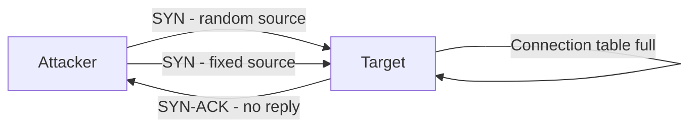

# TCP SYN Flood (DoS)

This scenario performs a **Denial-of-Service (DoS) attack** using a TCP SYN flood generated with `hping3` from the attacker container.

A SYN flood sends a large volume of TCP SYN packets without ever completing the three-way handshake. The server allocates a half-open connection entry for each packet, filling its connection table and preventing new legitimate sessions from being established.

---

## Attack Script

Location:
> `scripts/attacks/dos_syn_flood_hping3.sh`

Basic usage:

```bash
./scripts/attacks/dos_syn_flood_hping3.sh clab-virtual-env-attacker
```

With explicit parameters:

```bash
./scripts/attacks/dos_syn_flood_hping3.sh clab-virtual-env-attacker 172.16.30.2 80 60
```

| Parameter            | Description                       | Default          |
|----------------------|-----------------------------------|------------------|
| `attacker-container` | Container executing the attack    | required         |
| `target`             | Target hostname or IP             | `enterprise.com` |
| `port`               | Target TCP port                   | `80`             |
| `timeout`            | Duration of each phase in seconds | `60`             |

---

## Attack Phases

The script runs two consecutive phases, each lasting the configured timeout.

### Phase 1 - Random Source IP

`--rand-source` randomises the origin IP address on every packet. Each SYN appears to come from a different host, which makes source-based filtering not effective and produces a distributed signature in Suricata logs.

### Phase 2 - Fixed Source IP

All packets originate from the container's real IP address. This is easier to correlate and block, but produces a clear single-source pattern in the Kibana dashboards that is useful for comparing.

---

## hping3 Flags

| Option            | Purpose                                                                   |
|-------------------|---------------------------------------------------------------------------|
| `-S`              | Set only the TCP SYN flag; initiates a handshake that is never completed |
| `-p`              | Target port                                                               |
| `--flood`         | Send packets as fast as possible without waiting for replies              |
| `--rand-source`   | Randomise the source IP on every packet (Phase 1 only)                    |
| `--tcp-timestamp` | Include the TCP timestamp option for more realistic-looking packets       |

---

## Execution Behaviour

Each phase is launched in the background and terminated via its PID after the timeout elapses. SIGINT (`-2`) is used rather than SIGTERM so hping3 can exit gracefully and print statistics. The parent shell calls `wait` to reap the child process cleanly.

!!! warning "Do not interrupt manually"
    Using `Ctrl+C` while the script is running exits the calling shell before the background child is reaped, which may leave a zombie hping3 process inside the container.



---

## Observed Effects

- **On the server:** `ss -s` will show a rapidly growing number of `SYN-RECV` sockets
- **In Suricata / Kibana:** Suricata's ET ruleset includes signatures for SYN flood patterns. Both random and fixed source variants will produce alerts, but with different source IP distributions visible in the Kibana dashboards
