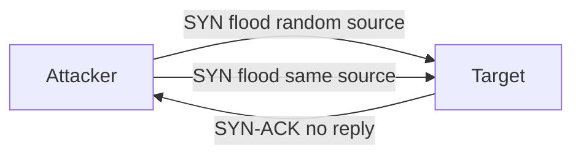

# TCP SYN Flood (DoS)

This scenario performs a **Denial-of-Service (DoS) attack** using a TCP SYN flood generated with `hping3` from an attacker container.

The script sends a large volume of SYN packets to a target host to exhaust server resources and disrupt normal connections.

---

## Attack Script

Location:
> `scripts/attacks/dos_syn_flood_hping3.sh`

Example usage:

```bash
./scripts/attacks/dos_syn_flood_hping3.sh clab-virtual-env-attacker
```

Specify target, port, and duration manually:

```bash
./scripts/attacks/dos_syn_flood_hping3.sh clab-virtual-env-attacker 172.16.30.2 80 60
```

| Parameter          | Description                                  |
|--------------------|----------------------------------------------|
| attacker-container | Container executing the attack               |
| target             | Target host (optional)                       |
| port               | Target port (optional)                       |
| timeout            | Duration of the attack in seconds (optional) |

!!! note "Default values"
    If no arguments are specified, the script targets: `enterprise.com` on port `80` for `60` seconds.

---

## Attack Configuration

The script runs two consecutive SYN flood attacks using `hping3`, sharing the same base options:

| Option            | Purpose                                                  |
|-------------------|----------------------------------------------------------|
| `-S`              | Set TCP SYN flag (half-open, never completes handshake)  |
| `-p`              | Target port                                              |
| `--flood`         | Send packets as fast as possible (no reply wait)         |
| `--tcp-timestamp` | Add TCP timestamp option                                 |

### Random Source

Adds `--rand-source` to randomise the origin IP on every packet. This makes source-based filtering ineffective, as each packet appears to come from a different address.

### Same Source

Omits `--rand-source`, sending all packets from the container's real IP. Easier to correlate and block, but useful for observing a single-source flood in the monitoring tools.

---

## Execution Behaviour

Each attack phase is launched in the background and killed via its PID after the timeout elapses. This allows the parent shell to call `wait` and reap the child process cleanly.

!!! warning "Do not interrupt manually"
    Using `Ctrl + C` during execution will exit the calling shell before the child process is reaped, which may leave behind zombie processes.

