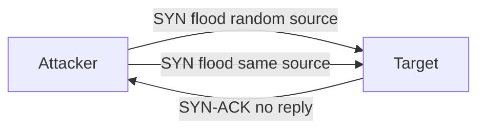

# TCP SYN Flood (DoS)

This scenario performs a **Denial-of-Service (DoS) attack** using a TCP SYN flood generated with `hping3` from an attacker container.

The script sends a high volume of SYN packets to a target host in order to exhaust server resources and disrupt normal connections.

---

## Attack Script

Location:
> `scripts/attacks/dos_syn_flood_hping3.sh`

Example usage:

```bash
./scripts/attacks/dos_syn_flood_hping3.sh clab-virtual-env-attacker
```

Specify target, port, and duration manually:

```bash
./scripts/attacks/dos_syn_flood_hping3.sh clab-virtual-env-attacker 172.16.30.2 80 60
```

| Parameter          | Description                                  |
|--------------------|----------------------------------------------|
| attacker-container | Container executing the attack               |
| target             | Target host (optional)                       |
| port               | Target port (optional)                       |
| timeout            | Duration of the attack in seconds (optional) |

If no target is specified, the script attacks: `enterprise.com` on port: `80` during: `60` seconds.

---

## Attack Configuration

The script executes two consecutive SYN flood attacks using `hping3`, sharing the same base options:

| Option          | Purpose                                                 |
|-----------------|---------------------------------------------------------|
| -S              | Set TCP SYN flag (half-open, never completes handshake) |
| -p              | Target port                                             |
| --flood         | Send packets as fast as possible (no reply wait)        |
| --tcp-timestamp | Add TCP timestamp option                                |

### Random Source

Adds `--rand-source` to randomise the origin IP on every packet, making source-based filtering ineffective.

### Same Source

Omits `--rand-source`, sending all packets from the container's real IP. Easier to correlate and block, but useful for observing a single-source flood pattern in the monitoring software.

---

## Execution Behaviour

The attack generates a massive volume of half-open TCP connections, which can make other clients unable to access or use the site at all.

The process is sent to background and killed via its PID after the timeout elapses, allowing the parent to call `wait` and reap the child cleanly, avoiding zombie processes.



---

## Notes

The process is killed automatically after the configured timeout. **Not recommended to use `Ctrl + C` to interrupt the script**, as doing so will also exit the calling shell before the child process is reaped.
