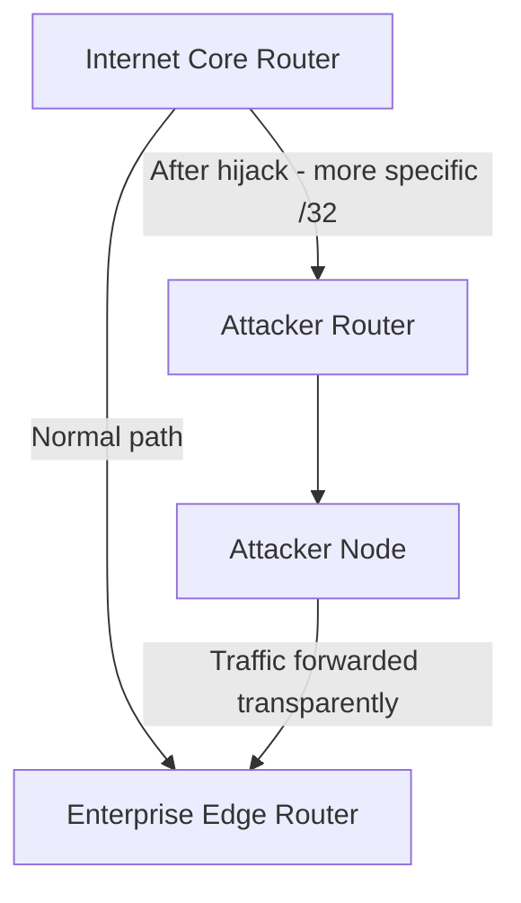

# OSPF Route Hijack

This scenario performs a **routing-layer attack** in which the attacker injects a fraudulent route into the OSPF domain to redirect enterprise traffic through the attacker's own node. The attacker can then inspect, modify, or impersonate services before forwarding traffic to its real destination.

This is a man-in-the-middle attack at Layer 3, exploiting the absence of OSPF authentication in the simulated environment.

---

## Attack Script

Location:
> `scripts/attacks/ospf_route_hijack.sh`

Basic usage:

```bash
./scripts/attacks/ospf_route_hijack.sh clab-virtual-env-attacker
```

With explicit parameters:

```bash
./scripts/attacks/ospf_route_hijack.sh clab-virtual-env-attacker 172.16.30.2/32 60
```

| Parameter            | Description                                  | Default          |
|----------------------|----------------------------------------------|------------------|
| `attacker-container` | Container executing the attack               | required         |
| `target-prefix`      | IP prefix to hijack (host route recommended) | `172.16.30.2/32` |
| `restore-delay`      | Seconds before restoring legitimate routing  | `60`             |

The attacker router container name is automatically derived from the attacker container name by replacing the `-attacker` suffix with `-router_attacker`.

---

## How the Attack Works

OSPF selects routes based on the most-specific prefix match. By injecting a `/32` host route for the enterprise router's public IP and redistributing it into OSPF with a low metric, every router in the domain will prefer the attacker's path over the legitimate `/30` subnet route already in the table.



---

## Attack Phases

The script executes the following sequence automatically:

| Phase | Action                                                                                      |
|-------|---------------------------------------------------------------------------------------------|
| 1     | Start `tcpdump` on the attacker to capture intercepted traffic                              |
| 2     | Enable IP forwarding and NAT on the attacker so packets are relayed to the real destination |
| 3     | Start a malicious nginx web server serving a page to impersonate the enterprise site        |
| 4     | Inject a `/32` static route via FRR `vtysh` and redistribute it into OSPF                   |
| 5     | After the timeout, stop the packet capture                                                  |
| 6     | Remove the injected route and withdraw the OSPF redistribution                              |
| 7     | Stop nginx and remove NAT rules                                                             |

---

## FRR Configuration Applied

The following commands are executed on the attacker router via `vtysh` during Phase 4:

```text
ip route <target-prefix> <attacker-ip>

router ospf
  redistribute static metric 1 metric-type 1
```

And reversed during Phase 6:

```text
no ip route <target-prefix> <attacker-ip>

router ospf
  no redistribute static
```

`metric-type 1` (Type 1 external) ensures the injected route's cost is added to the internal OSPF path cost, making it consistently preferred over the legitimate route.

---

## Observed Effects

- **Routing tables:** After Phase 4, running `ip route` on any router in the OSPF domain will show the attacker's address as the next hop for the hijacked prefix
- **Web traffic:** HTTP requests to `enterprise.com` will be served by the attacker's nginx node rather than the real DMZ server
- **In Suricata / Kibana:** Traffic flows show unexpected source/destination patterns
- **Capture file:** A pcap of all intercepted traffic is available at `/tmp/hijack_capture.pcap` inside the attacker container after the attack completes

!!! warning "OSPF Authentication"
    This attack succeeds because the simulated environment uses OSPF without MD5 authentication. In a production network, enabling OSPF authentication would prevent unauthenticated route injection.

!!! note "Cleanup"
    After the configured timeout the script automatically restores the legitimate routing state and cleans up all modified configuration. OSPF will reconverge within a few seconds.
