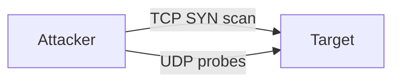

# Port Scanning

This scenario performs a **network reconnaissance scan** using `nmap` from an attacker container.

The script runs two scans against a target host:

1. **TCP SYN scan** across all ports.
2. **UDP scan** on the most common UDP ports.

---

## Attack Script

Location:
> `scripts/attacks/port_scanning.sh`

Example usage:

```bash
./scripts/attacks/port_scanning.sh clab-virtual-env-attacker
```

Specify a target manually:

```bash
./scripts/attacks/port_scanning.sh clab-virtual-env-attacker 172.16.30.2
```

| Parameter          | Description                    |
|--------------------|--------------------------------|
| attacker-container | Container executing the attack |
| target             | Target host (optional)         |

!!! note "Default values"
    If no target is specified, the script scans: `enterprise.com`.

---

## Scan Configuration

The script runs two sequential scans using `nmap`.

### TCP Scan

Full port scan with service and OS detection.

| Option | Purpose              |
|--------|----------------------|
| `-sS`  | TCP SYN scan         |
| `-sV`  | Service detection    |
| `-sC`  | Default NSE scripts  |
| `-O`   | OS detection         |
| `-p-`  | Scan all ports       |
| `-T4`  | Faster timing        |

### UDP Scan

Common UDP service discovery.

| Option          | Purpose               |
|-----------------|-----------------------|
| `-sU`           | UDP scan              |
| `-sV`           | Service detection     |
| `--top-ports 100` | Scan common UDP ports |
| `-T4`           | Faster timing         |

---

## Network Behaviour

The scan generates a high volume of connection attempts which are inspected by the IDS.

