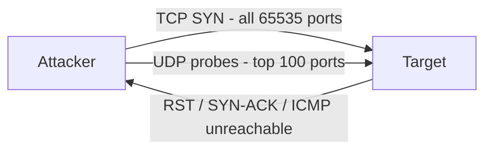

# Port Scanning

This scenario performs a **network reconnaissance scan** using `nmap` from the attacker container. It is typically the first step in an attack chain, used to discover which services are running on a target before attempting exploitation.

The script runs two sequential scans: a full TCP SYN scan across all ports, followed by a UDP scan of the most common service ports.

---

## Attack Script

Location:
> `scripts/attacks/port_scanning.sh`

Basic usage:

```bash
./scripts/attacks/port_scanning.sh clab-virtual-env-attacker
```

With explicit target:

```bash
./scripts/attacks/port_scanning.sh clab-virtual-env-attacker 172.16.30.2
```

| Parameter            | Description                    | Default          |
|----------------------|--------------------------------|------------------|
| `attacker-container` | Container executing the attack | required         |
| `target`             | Target hostname or IP          | `enterprise.com` |

---

## TCP Scan

A full SYN scan across all 65535 ports with service detection and OS fingerprinting.

| Option     | Purpose                                                            |
|------------|--------------------------------------------------------------------|
| `-sS`      | SYN scan: sends SYN, reads response, never completes the handshake |
| `-sV`      | Service and version detection on open ports                        |
| `-sC`      | Default NSE scripts: banner grabbing, basic checks                 |
| `-O`       | OS fingerprinting based on TCP/IP stack behaviour                  |
| `-p-`      | Scan all ports (1–65535)                                           |
| `-T4`      | Aggressive timing: faster scan, more easily detected               |
| `--reason` | Show the reason each port is in its reported state                 |

---

## UDP Scan

Common UDP service discovery against the 100 most frequently used UDP ports.

| Option            | Purpose                                                              |
|-------------------|----------------------------------------------------------------------|
| `-sU`             | UDP scan: sends UDP probes and interprets ICMP unreachable responses |
| `-sV`             | Service detection on discovered open UDP ports                       |
| `--top-ports 100` | Limit to the 100 most common UDP ports for speed                     |
| `-T4`             | Aggressive timing                                                    |

---

## Network Behaviour

The scan generates a high volume of connection attempts across many ports in a short time, which is a strong indicator of reconnaissance activity.



---

## Observed Effects

- **In Suricata / Kibana:** The ruleset includes signatures specifically for nmap SYN scans. These will appear as medium-severity alerts in the Kibana Security dashboard
- **In eve.json:** Flow records will show a large number of short-lived connections from the attacker IP to many different destination ports within a narrow time window
