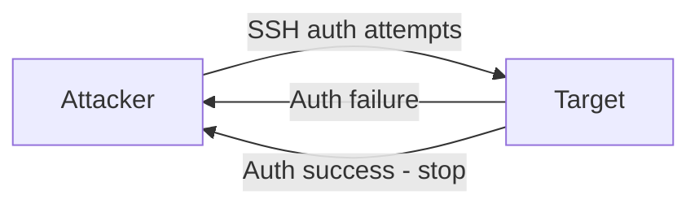

# SSH Brute Force

This scenario performs a **credential brute-force attack** over SSH using `hydra` from an attacker container.

The script tries passwords from a wordlist against a target host until a valid combination is found.

---

## Attack Script

Location:
> `scripts/attacks/ssh_bruteforce_hydra.sh`

Example usage:

```bash
./scripts/attacks/ssh_bruteforce_hydra.sh clab-virtual-env-attacker
```

Specify target, port, and user manually:

```bash
./scripts/attacks/ssh_bruteforce_hydra.sh clab-virtual-env-attacker enterprise.com 22 vntd
```

| Parameter          | Description                                                              |
|--------------------|--------------------------------------------------------------------------|
| attacker-container | Container executing the attack                                           |
| target             | Target host (optional)                                                   |
| port               | Target SSH port (optional)                                               |
| user               | Username to attack, or `list` to use a username wordlist (optional)      |

!!! note "Default values"
    If no arguments are specified, the script targets: `enterprise.com` on port `22` with user `vntd`.

---

## Attack Configuration

The script runs `hydra` with the following options:

| Option | Purpose                                            |
|--------|----------------------------------------------------|
| `-l`   | Single username to attempt                         |
| `-L`   | Username list (used when `user` is set to `list`)  |
| `-P`   | Password wordlist file                             |
| `-s`   | Target port                                        |
| `-t`   | Number of parallel tasks (threads)                 |
| `-V`   | Verbose output, prints each attempt                |
| `-f`   | Stop after the first valid credential is found     |

The attack runs with **64 parallel threads** (`-t 64`) for faster enumeration.

### Username Mode

Depending on the `user` parameter, `hydra` is invoked in one of two modes:

#### Single User

Uses `-l <user>` to target a specific username. The attack focuses only on password discovery.

#### User List

Uses `-L <userlist>` to iterate over common usernames alongside the password list. This increases coverage but also the total number of attempts.

---

## Wordlist Preparation

Before launching the attack, the script prepares the password list:

1. A short custom wordlist (`ssh_wordlist.txt`) is written into the container, containing common weak passwords including the valid credential.
2. The primary password list (`10k-most-common.txt`) is checked for the target password using an exact match (`grep -qx`).
3. If the password is not found, the custom wordlist is appended to the primary list.

!!! note "Guaranteed detection"
    This ensures a successful login event always occurs, producing a visible alert in the IDS and Elastic stack.

!!! tip "Speed"
    By default, the file used in the script is `ssh_wordlist.txt`. For a more realistic test change the `PASSLIST` variable for another available file, although it takes a considerable ammount of time.

---

## Execution Behaviour

`hydra` tries every password in the list against the target SSH service and stops as soon as a valid pair is found (`-f`).

The high number of parallel threads (`-t 64`) produces a clearly detectable list of failed authentication attempts in the IDS logs.


