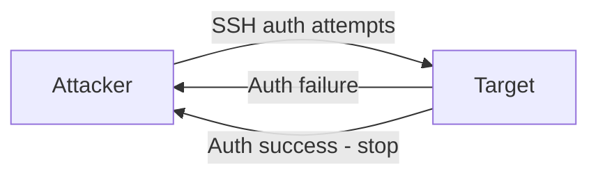

# SSH Brute Force

This scenario performs a **credential brute-force attack** against the SSH service using `hydra` from the attacker container. The script tries passwords from a wordlist against a target host until a valid combination is found.

---

## Attack Script

Location:
> `scripts/attacks/ssh_bruteforce_hydra.sh`

Basic usage:

```bash
./scripts/attacks/ssh_bruteforce_hydra.sh clab-virtual-env-attacker
```

With explicit parameters:

```bash
./scripts/attacks/ssh_bruteforce_hydra.sh clab-virtual-env-attacker enterprise.com 22 vntd
```

| Parameter            | Description                                              | Default          |
|----------------------|----------------------------------------------------------|------------------|
| `attacker-container` | Container executing the attack                           | required         |
| `target`             | Target hostname or IP                                    | `enterprise.com` |
| `port`               | Target SSH port                                          | `22`             |
| `user`               | Username to attack, or `list` to use a username wordlist | `vntd`           |

---

## Attack Configuration

### hydra Flags

| Option | Purpose                                               |
|--------|-------------------------------------------------------|
| `-l`   | Single username to attempt                            |
| `-L`   | Username wordlist (used when `user` is set to `list`) |
| `-P`   | Password wordlist file                                |
| `-s`   | Target port                                           |
| `-t`   | Number of parallel tasks (threads)                    |
| `-V`   | Verbose: print each username/password attempt         |
| `-f`   | Stop as soon as the first valid credential is found   |

The attack runs with **64 parallel threads** for fast enumeration.

### Username Mode

Depending on the `user` parameter, hydra operates in one of two modes:

- **Single user** (`-l <user>`): focuses password discovery against one known account.
- **User list** (`-L <userlist>`): iterates over a list of common usernames alongside the password list, increasing coverage at the cost of total attempts.

---

## Wordlist Preparation

Before launching the attack, the script writes a short custom wordlist (`ssh_wordlist.txt`) into the container that includes the real credential (`pswd`). This guarantees a successful login event always occurs, producing a visible alert in Suricata and Elasticsearch.

The primary password list used can be changed by editing the `PASSLIST` variable in the script:

| List                                       | Size            | Notes                                        |
|--------------------------------------------|-----------------|----------------------------------------------|
| `ssh_wordlist.txt`                         | ~10 entries     | Default. Fast, reproducible, always succeeds |
| `10k-most-common.txt`                      | 10,000 entries  | More realistic, takes longer                 |
| `xato-net-10-million-passwords-100000.txt` | 100,000 entries | Comprehensive, takes significantly longer    |

If the real password is not already present in the chosen list, the custom wordlist is appended automatically.

---

## Execution Behaviour

Hydra tries every password in the list and stops as soon as a valid pair is found (`-f`). The high thread count (`-t 64`) produces a clearly detectable volume of failed authentication attempts in the IDS logs before the successful login appears.



---

## Observed Effects

- **In Suricata / Kibana:** Failed SSH authentication attempts appear as `ET SCAN SSH Brute Force Tool` and similar alerts. The successful login is visible as a distinct flow event following the series of failures
- **In eve.json:** SSH flow records show rapid repeated connections from the attacker IP to port 22, terminating with a longer-lived session once credentials are found

!!! note "Default credential"
    The SSH service on all `server_vntd` containers uses `vntd` / `pswd` as the default credential. See [SSH Service](../../services/ssh.md) for details.
