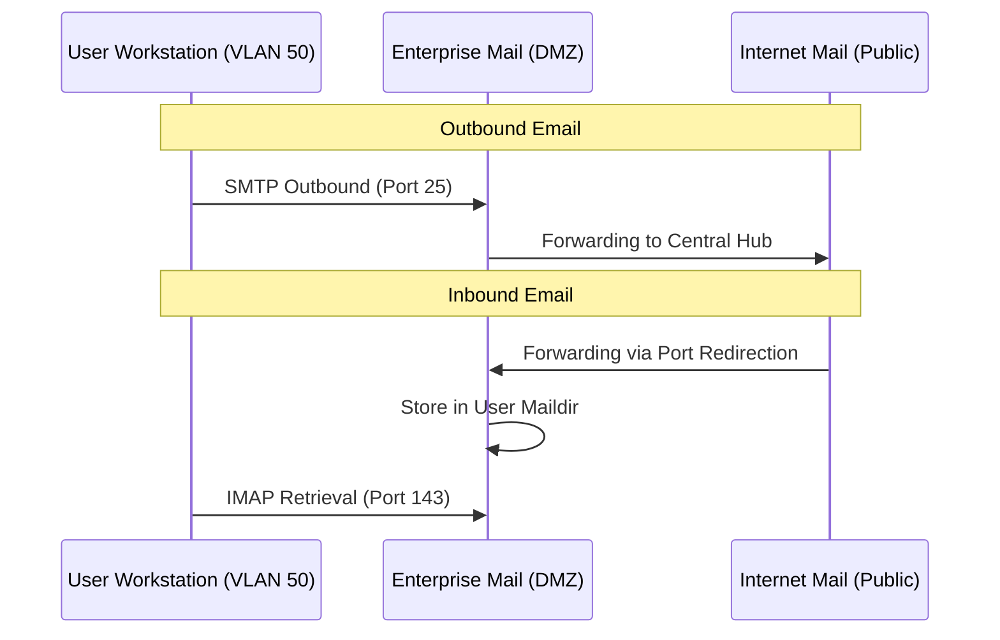

# Mail Service

This document describes the **Mail service implementation** used in the laboratory.

The mail infrastructure is composed of:
- **Postfix:** SMTP server (mail transfer).
- **Dovecot:** IMAP server (mail retrieval).
- **Mutt:** Mail client (end-user interaction).

The same `server_vntd` image is reused to implement:
- The **Enterprise Mail Server (DMZ)**.
- The **Main Internet Mail Server**.

---

## Architecture

The mail architecture simulates a realistic **hub-and-spoke deployment**:
- The **Enterprise Mail Server (DMZ)** handles internal users.
- The **Internet Mail Server** acts as the public authority SMTP.
- Enterprise SMTP forwards outbound mail to the Internet server.
- The Internet server discards unknown destinations.



**Traffic flow:**
```text
Internal Client -> DMZ Mail Server -> Internet Mail Server -> Destination
```

**Inbound traffic:**
```text
Internet Mail Server → Router (port 25 forward) → DMZ Mail Server
```

Traffic whose destination is the user's same mail service provider does not get redirected.

!!! note "Security rules"
    From the Internet towards the Enterprise network, the router forwards **TCP port 25** traffic to the `dmz_server`.

---

## Service Activation

The mail services are enabled only **one** of the following environment variables is set:

```yml
env:
    VAR_NAME: 1
```

| VAR_NAME         | Purpose                                         |
|------------------|-------------------------------------------------|
| MAIL_SERVER      | Enables Enterprise mail server (spoke)          |
| MAIN_MAIL_SERVER | Enables Internet main mail server (central hub) |

If neither variable is set:
- Postfix does not start.
- Dovecot does not start.

---

## File Structure and Configuration

Mail configuration is injected using **bind mounts** defined in the topology.

### SMTP (Postfix)

**Enterprise SMTP**
File:
```sh
./config/server/smtp/enterprise/main.cf
```

Purpose:
- Defines SMTP behavior for Enterprise domain.
- Forwards outbound mail to the Internet server.
- Defines relay host and domain policies.

**Internet SMTP (Main Server)**
Files:
```sh
./config/server/smtp/internet/main.cf
./config/server/smtp/internet/transport
./config/server/smtp/internet/relay_recipients
```

| File               | Purpose                             |
|--------------------|-------------------------------------|
| `main.cf`          | Core configuration                  |
| `transport`        | Defines domain routing rules        |
| `relay_recipients` | Specifies valid recipient addresses |

When `MAIN_MAIL_SERVER` is set, the entrypoint:
- Adjusts file permissions and ownership.
- Runs `postmap` on transport and relay files.

!!! important "Unknown Destination"
    Unknown mail addresses are discarded.

Postfix is initialized automatically based on the chosen configuration.

---

### IMAP (Dovecot)

Files:
```sh
10-auth.conf
10-mail.conf
auth-system.conf.ext
dovecot.conf
```

Purpose:
- Authentication configuration.
- Maildir storage definition.
- System user authentication.
- Global Dovecot behavior.

Dovecot provides:
- IMAP on port 143.
- Maildir mailbox access.

!!! note "IMAP vs POP3"
    POP3 is intentionally not installed.

---

### Mail Users Directory

All mail users are defined through bind:

```sh
./config/pc/mutt -> /mail-users:ro # Read Only
```

Structure:
```
/<directory>/
├── enterprise/
│   ├── alice
│   ├── clark
│   └── ...
└── internet/
    └── olivia
```

Each file represents a user account.

At startup:
- The entrypoint scans the directory.
- Creates system users.
- Sets passwords equal to usernames (weak, but easy to manage).
- Creates Maildir.
- Sets ownership.
- Disables shell access.

!!! info "Bind user files"
    User files are bound to avoid creating a new file containing only the users to be created by each server.

---

## User Creation

Users are automatically created using:

```
useradd -m -s /sbin/nologin <user>
```

For each user:
- Home directory created.
- Maildir initialized.
- Password = username.
- IMAP access allowed.
- Shell access disabled.

This ensures isolation between users and realistic mail behavior in a simplified lab management.

---

## Network Behavior

| Service | Port | Protocol |
| ------- | ---- | -------- |
| SMTP    | 25   | TCP      |
| IMAP    | 143  | TCP      |

TLS is **not** enabled. This allows clear:
- Traffic inspection.
- IDS monitoring.
- Clear-text credential observation.

From the router, inbound port 25 traffic from Internet is forwarded to `dmz_server`.

---

## Mail Client (Mutt)

End-user systems use **Mutt** as the mail client. Each PC binds a specific configuration file:

Example:

```sh
./config/pc/mutt/enterprise/clark -> /root/.mutt/muttrc
```

Example configuration:
```sh
set from = "clark@enterprise.com"
set realname = "Clark Enterprise"
set use_from = yes

# IMAP
set folder = "imap://clark@192.168.10.10:143/"
set imap_user = "clark"
set imap_pass = "clark"
set spoolfile = "+INBOX"

# SMTP
set smtp_url = "smtp://clark@192.168.10.10/"
set smtp_pass = "clark"

# Editor
#set editor = "vim"
set charset = UTF-8

# SSL
set ssl_starttls = no
set ssl_force_tls = no
```

Each PC can simulate a different user depending on which bind is used.

This design allows:
- Simulating multiple employees.
- Credential exposure.
- Clear and simple mail flow testing.

---

## Using the Mail Service

From any client, write on the terminal:
```bash
mutt
```

!!! warning "Mandatory Connectivity"
    The device **must** have connection to the mail provider. Otherwise, the automatic sign up process will fail. For DHCP users, wait for a moment or check if an address has been assigned using `ifconfig`.

!!! important "Refresh Mutt"
    The `mutt` interface is simple and does **not** detect new emails. To receive new emails, the user needs to exit the program and access it again.

---

## Security considerations

This setup is intentionally weak and uses on purpose:
- Weak passwords.
- No TLS.
- Plain-text authentication.

This is required for:
- Clear and easy traffic inspection.
- IDS pattern detection.

!!! warning "Lab Isolation"
    This configuration must **never** be used in production environments.
    This is designed for training and must remain isolated to prevent the laboratory from acting as a real relay for external spam or malicious mail.
